# pkt-todolist 기술 아키텍처 다이어그램

**버전**: 1.0
**작성일**: 2025-11-26
**상태**: 최종
**작성자**: Claude
**참조 문서**:
- [도메인 정의서](./1-domain-definition.md)
- [PRD](./3-prd.md)
- [프로젝트 구조](./5-project-structure.md)

---

## 목차

1. [전체 시스템 아키텍처](#1-전체-시스템-아키텍처)
2. [프론트엔드 아키텍처](#2-프론트엔드-아키텍처)
3. [백엔드 아키텍처](#3-백엔드-아키텍처)
4. [데이터 흐름 다이어그램](#4-데이터-흐름-다이어그램)
5. [인증 흐름 다이어그램](#5-인증-흐름-다이어그램)
6. [데이터베이스 스키마](#6-데이터베이스-스키마)

---

## 1. 전체 시스템 아키텍처

### C4 컨테이너 다이어그램

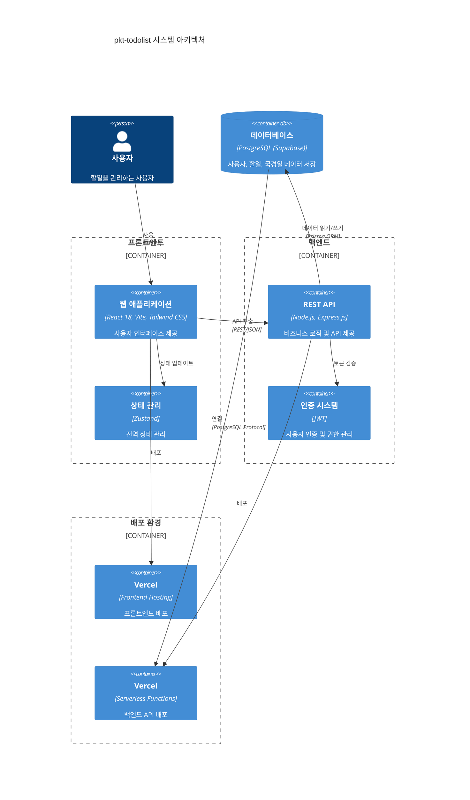

### 시스템 구성 요소 설명

| 구성 요소 | 기술 스택 | 역할 | 배포 위치 |
|-----------|----------|------|-----------|
| **웹 애플리케이션** | React 18, Vite, Tailwind CSS | 사용자 인터페이스 제공 | Vercel |
| **상태 관리** | Zustand | 클라이언트 전역 상태 관리 | 클라이언트 |
| **REST API** | Node.js, Express.js | 비즈니스 로직 및 API 제공 | Vercel Serverless |
| **인증 시스템** | JWT (jsonwebtoken) | 사용자 인증 및 권한 관리 | Vercel Serverless |
| **데이터베이스** | PostgreSQL (Supabase) | 데이터 영구 저장 | Supabase Cloud |
| **ORM** | Prisma | 데이터베이스 액세스 추상화 | API Layer |

### 핵심 설계 원칙

1. **레이어드 아키텍처**: 프레젠테이션, 비즈니스, 데이터 레이어 명확히 분리
2. **단방향 의존성**: 상위 레이어가 하위 레이어에만 의존
3. **Stateless 백엔드**: 수평 확장 가능한 서버리스 구조
4. **JWT 기반 인증**: 세션 없이 토큰 기반 인증
5. **단순성 우선**: 필요한 기능만 구현 (YAGNI 원칙)

---

## 2. 프론트엔드 아키텍처

### 프론트엔드 레이어 구조

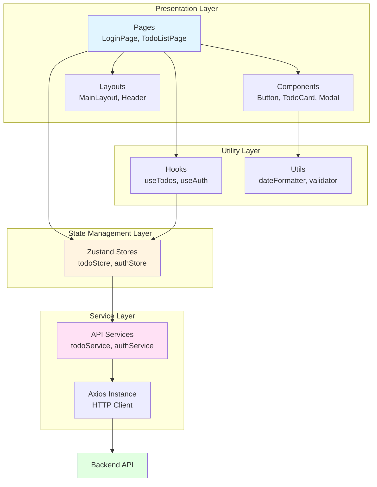

### 주요 컴포넌트 설명

#### Presentation Layer (UI)
- **Pages**: 라우트별 페이지 컴포넌트 (LoginPage, TodoListPage, TrashPage 등)
- **Components**: 재사용 가능한 UI 컴포넌트 (Button, Input, TodoCard, Modal)
- **Layouts**: 공통 레이아웃 구조 (Header, Sidebar, MainLayout)

#### State Management Layer
- **Zustand Stores**: 전역 상태 관리
  - `todoStore`: 할일 목록, 필터, 정렬 상태
  - `authStore`: 로그인 정보, JWT 토큰
  - `holidayStore`: 국경일 데이터
  - `uiStore`: 모달, 토스트 등 UI 상태

#### Service Layer (API)
- **API Services**: 백엔드 API 호출 추상화
  - `todoService`: 할일 CRUD API 호출
  - `authService`: 인증 API 호출 (로그인, 회원가입, 토큰 갱신)
  - `holidayService`: 국경일 API 호출
- **Axios Instance**: HTTP 클라이언트, 인터셉터로 JWT 토큰 자동 첨부

#### Utility Layer
- **Custom Hooks**: 비즈니스 로직 재사용 (useTodos, useAuth, useDebounce)
- **Utils**: 순수 유틸리티 함수 (날짜 포맷팅, 유효성 검증, 토큰 관리)

### 데이터 흐름 (프론트엔드)

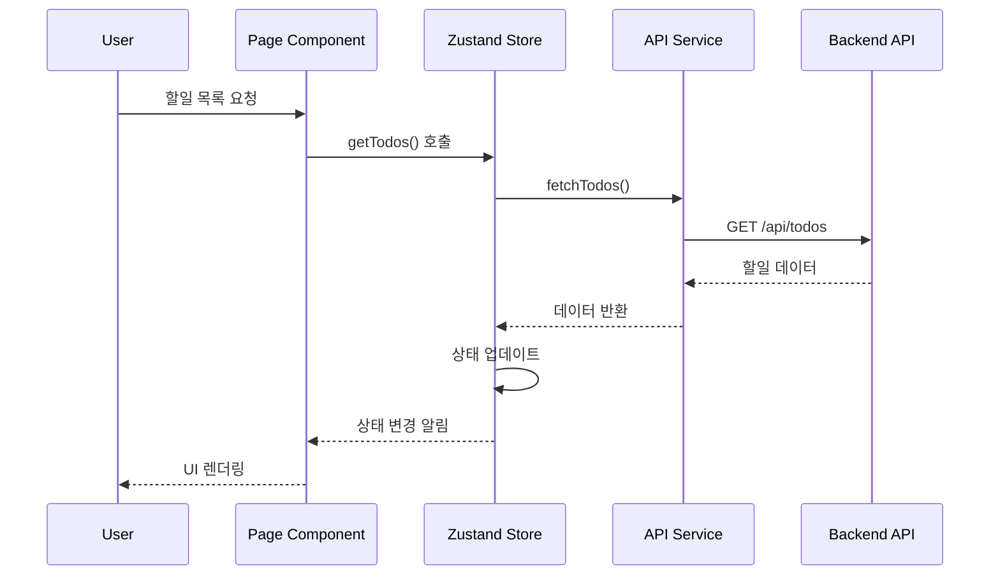

### 주요 기술 스택

| 라이브러리 | 용도 | 버전 |
|-----------|------|------|
| React | UI 라이브러리 | 18.x |
| Zustand | 상태 관리 | 최신 |
| React Router | 라우팅 | v6 |
| Axios | HTTP 클라이언트 | 최신 |
| Tailwind CSS | 스타일링 | 최신 |
| React Hook Form | 폼 관리 | 최신 |
| Zod | 스키마 검증 | 최신 |
| date-fns | 날짜 처리 | 최신 |

---

## 3. 백엔드 아키텍처

### 백엔드 레이어 구조

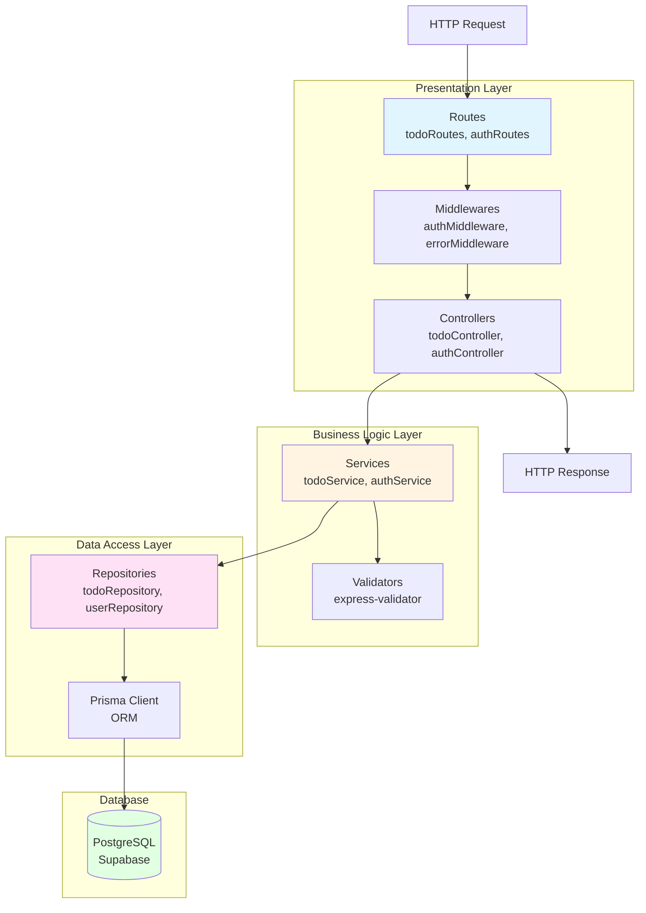

### 주요 레이어 설명

#### Presentation Layer
- **Routes**: API 엔드포인트 정의 및 라우팅
  - `todoRoutes.js`: `/api/todos` 관련 라우트
  - `authRoutes.js`: `/api/auth` 관련 라우트
  - `holidayRoutes.js`: `/api/holidays` 관련 라우트

- **Controllers**: HTTP 요청/응답 처리
  - 요청 파라미터 추출
  - 응답 포맷팅 (JSON)
  - HTTP 상태 코드 설정

- **Middlewares**: 요청 전처리
  - `authMiddleware`: JWT 토큰 검증
  - `errorMiddleware`: 에러 핸들링
  - `validationMiddleware`: 요청 데이터 검증
  - `rateLimitMiddleware`: API 호출 제한

#### Business Logic Layer
- **Services**: 핵심 비즈니스 로직
  - 할일 생성, 수정, 삭제, 완료 처리
  - 휴지통 로직 (소프트 삭제, 복원)
  - 사용자 권한 검증
  - JWT 토큰 생성/갱신

- **Validators**: 데이터 유효성 검증
  - 이메일 형식 검증
  - 비밀번호 강도 검증
  - 날짜 유효성 검증 (dueDate >= startDate)

#### Data Access Layer
- **Repositories**: 데이터베이스 액세스 추상화
  - CRUD 작업 캡슐화
  - 쿼리 최적화 (인덱싱)
  - 트랜잭션 관리

- **Prisma Client**: ORM
  - 타입 안전성
  - 자동 마이그레이션
  - 쿼리 빌더

### API 엔드포인트 구조

```mermaid
graph LR
    A[API Gateway] --> B[/api/auth]
    A --> C[/api/todos]
    A --> D[/api/holidays]
    A --> E[/api/users]
    A --> F[/api/trash]

    B --> B1[POST /register]
    B --> B2[POST /login]
    B --> B3[POST /refresh]
    B --> B4[POST /logout]

    C --> C1[GET /]
    C --> C2[POST /]
    C --> C3[GET /:id]
    C --> C4[PUT /:id]
    C --> C5[DELETE /:id]
    C --> C6[PATCH /:id/complete]
    C --> C7[PATCH /:id/restore]

    D --> D1[GET /]
    D --> D2[POST /]
    D --> D3[PUT /:id]

    E --> E1[GET /me]
    E --> E2[PATCH /me]

    F --> F1[GET /]
    F --> F2[DELETE /:id]

    style A fill:#e1f5ff
    style B fill:#fff4e1
    style C fill:#ffe1f5
    style D fill:#e1ffe1
    style E fill:#f5e1ff
    style F fill:#ffe1e1
```

### 주요 기술 스택

| 라이브러리 | 용도 | 버전 |
|-----------|------|------|
| Node.js | 런타임 환경 | 18+ |
| Express.js | 웹 프레임워크 | 4.x |
| Prisma | ORM | 최신 |
| jsonwebtoken | JWT 인증 | 최신 |
| bcrypt | 비밀번호 해싱 | 최신 |
| express-validator | 요청 검증 | 최신 |
| cors | CORS 설정 | 최신 |
| helmet | 보안 헤더 | 최신 |
| express-rate-limit | Rate Limiting | 최신 |

---

## 4. 데이터 흐름 다이어그램

### 할일 생성 흐름

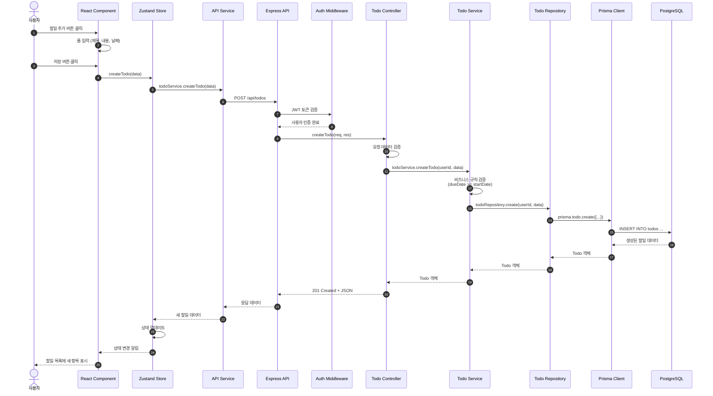

### 할일 조회 흐름 (캐싱 포함)

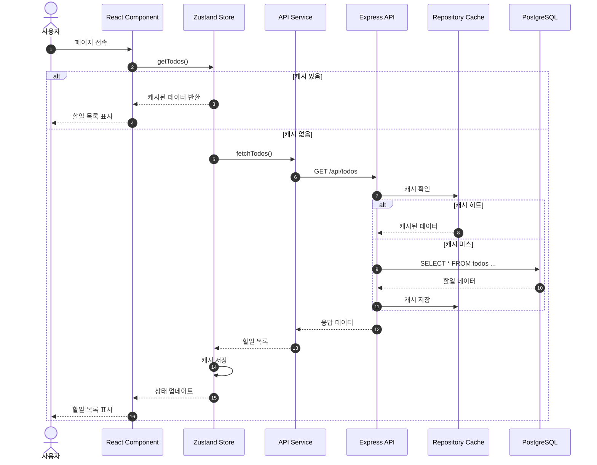

### 할일 삭제 및 복원 흐름 (소프트 삭제)

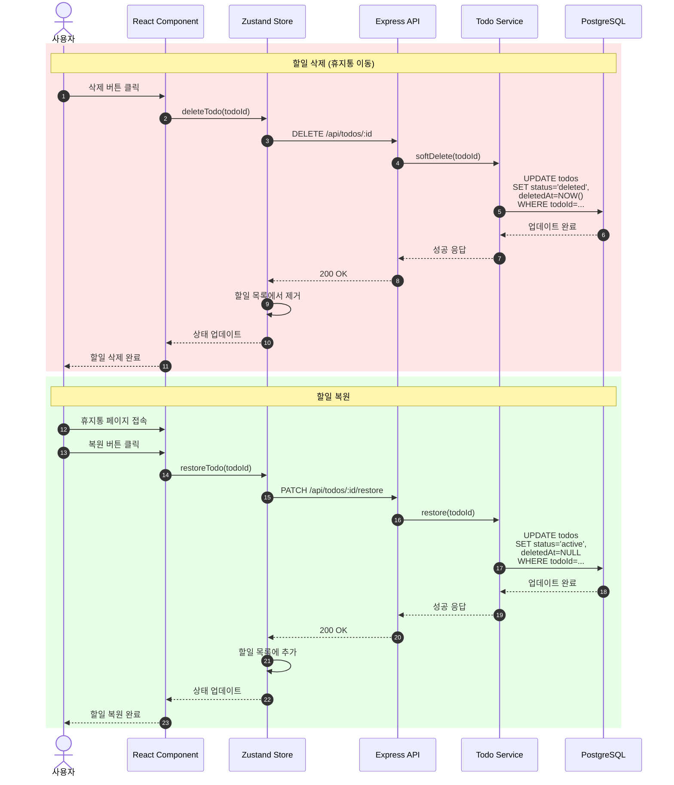

---

## 5. 인증 흐름 다이어그램

### 회원가입 및 로그인 흐름

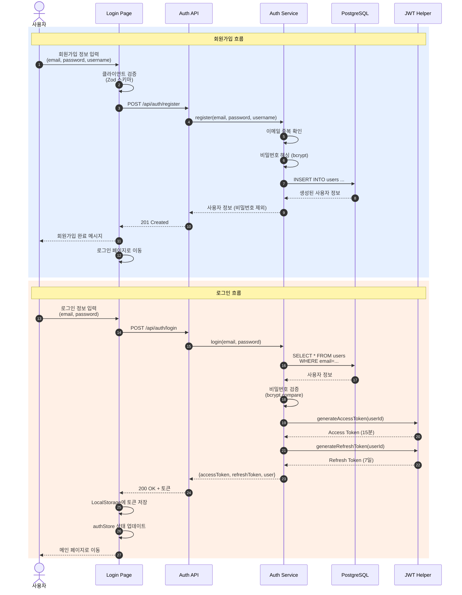

### JWT 토큰 갱신 흐름

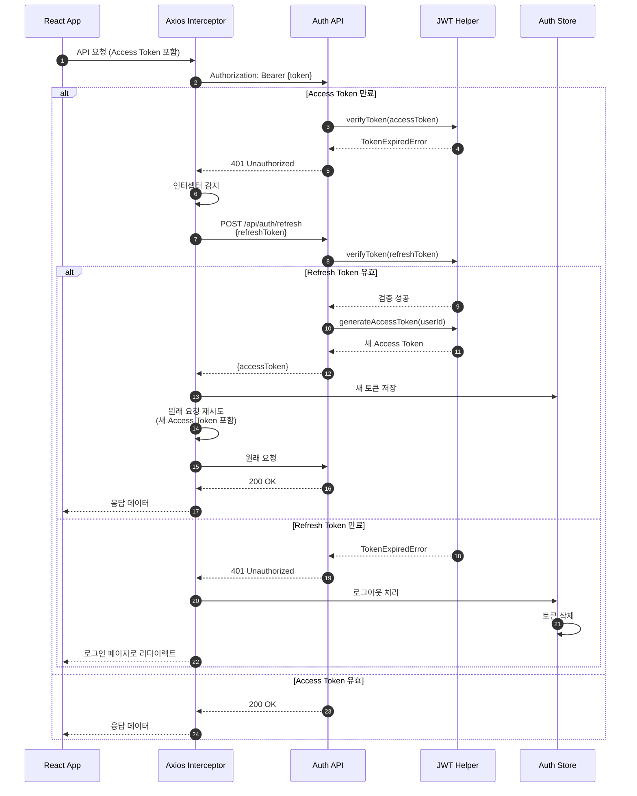

### 인증 미들웨어 동작

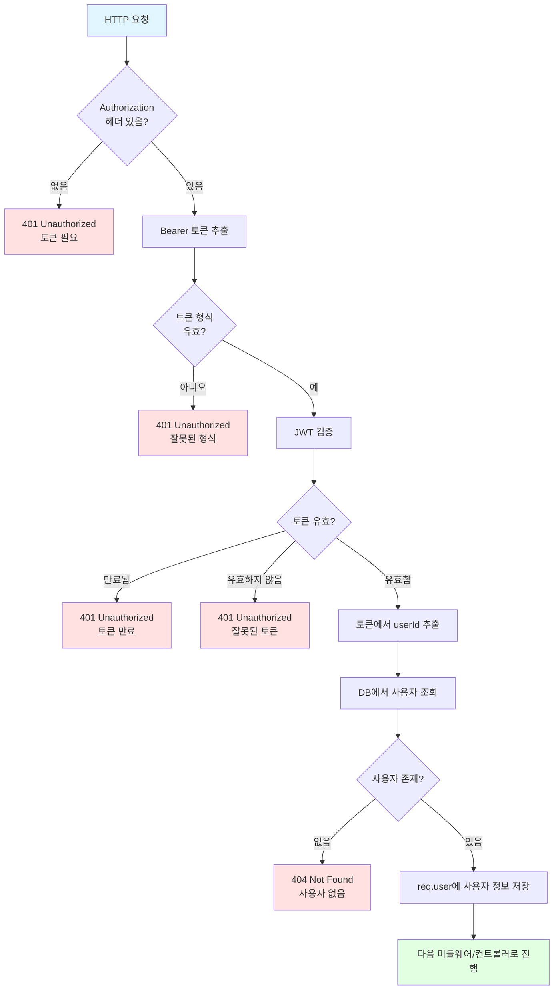

### JWT 토큰 구조

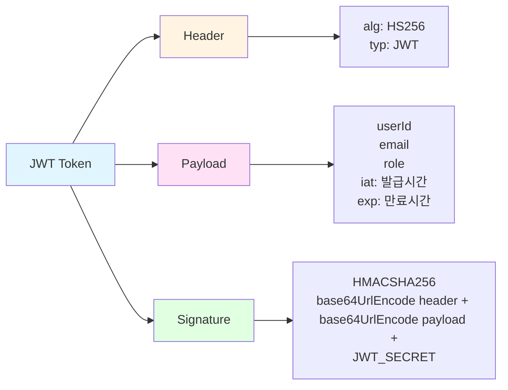

---

## 6. 데이터베이스 스키마

### ERD (Entity Relationship Diagram)

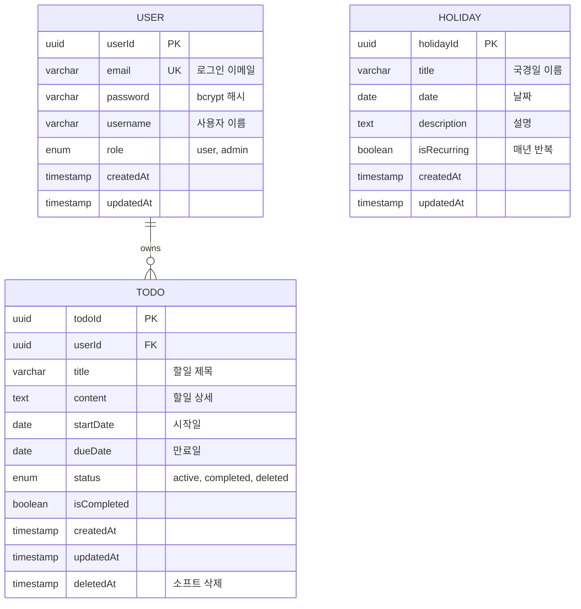

### 데이터베이스 인덱스 전략

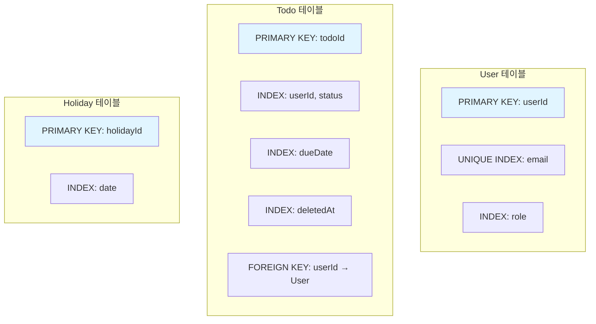

### Prisma 스키마 (간소화)

```prisma
// User 모델
model User {
  userId    String   @id @default(uuid())
  email     String   @unique
  password  String
  username  String
  role      Role     @default(USER)
  createdAt DateTime @default(now())
  updatedAt DateTime @updatedAt
  todos     Todo[]

  @@index([role])
}

// Todo 모델
model Todo {
  todoId      String     @id @default(uuid())
  userId      String
  user        User       @relation(fields: [userId], references: [userId], onDelete: Cascade)
  title       String
  content     String?
  startDate   DateTime?
  dueDate     DateTime?
  status      TodoStatus @default(ACTIVE)
  isCompleted Boolean    @default(false)
  createdAt   DateTime   @default(now())
  updatedAt   DateTime   @updatedAt
  deletedAt   DateTime?

  @@index([userId, status])
  @@index([dueDate])
  @@index([deletedAt])
}

// Holiday 모델
model Holiday {
  holidayId   String   @id @default(uuid())
  title       String
  date        DateTime
  description String?
  isRecurring Boolean  @default(true)
  createdAt   DateTime @default(now())
  updatedAt   DateTime @updatedAt

  @@index([date])
}

// Enums
enum Role {
  USER
  ADMIN
}

enum TodoStatus {
  ACTIVE
  COMPLETED
  DELETED
}
```

---

## 부록

### 아키텍처 설계 원칙 요약

| 원칙 | 설명 | 적용 예시 |
|------|------|-----------|
| **레이어드 아키텍처** | 계층 분리로 관심사 분리 | Presentation → Business → Data |
| **단방향 의존성** | 상위 레이어만 하위 레이어 의존 | Controller → Service → Repository |
| **SOLID 원칙** | 단일 책임, 의존성 역전 | 각 Service는 하나의 엔티티만 담당 |
| **DRY (Don't Repeat Yourself)** | 중복 코드 제거 | Utils, Hooks, Services로 추출 |
| **KISS (Keep It Simple)** | 단순성 유지 | 필요한 기능만 구현 |
| **Stateless Backend** | 서버 무상태 유지 | JWT 토큰 기반 인증, 세션 없음 |
| **API First** | API 중심 설계 | RESTful API 명세 우선 작성 |

### 보안 아키텍처

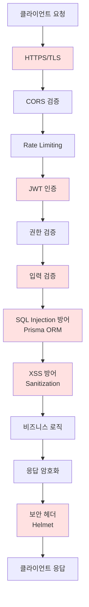

### 배포 아키텍처

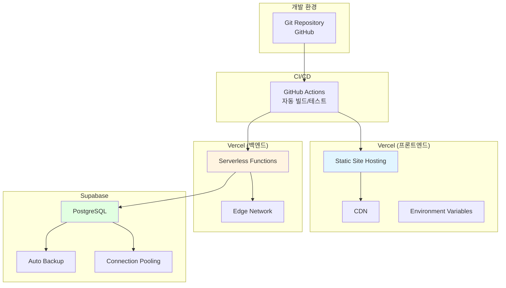

### 성능 최적화 전략

| 계층 | 최적화 기법 | 구현 방법 |
|------|------------|-----------|
| **프론트엔드** | Code Splitting | React.lazy(), Suspense |
| | Lazy Loading | 이미지, 컴포넌트 지연 로딩 |
| | 캐싱 | Zustand 상태 캐싱 |
| | 번들 최소화 | Vite 빌드 최적화 |
| **백엔드** | 데이터베이스 인덱싱 | userId, status, dueDate |
| | 쿼리 최적화 | Prisma 쿼리 최적화 |
| | Connection Pooling | Supabase 자동 설정 |
| **네트워크** | CDN | Vercel Edge Network |
| | HTTPS/2 | Vercel 기본 제공 |
| | gzip 압축 | Express 미들웨어 |

---

**문서 종료**
