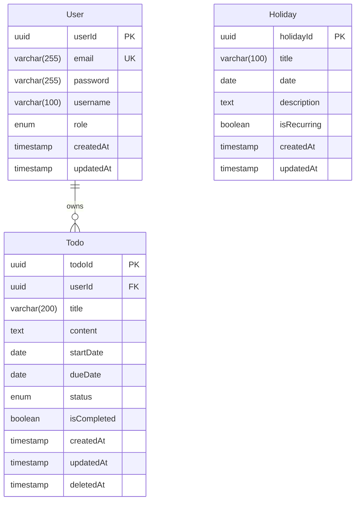

# pkt-todolist 데이터 모델 (ERD)

**버전**: 1.0
**작성일**: 2025-11-26
**상태**: 최종
**참조 문서**:
- [도메인 정의서](./1-domain-definition.md)
- [PRD](./3-prd.md)

---

## 목차

1. [ERD 다이어그램](#1-erd-다이어그램)
2. [엔티티 상세](#2-엔티티-상세)
3. [Prisma 스키마](#3-prisma-스키마)
4. [인덱스 전략](#4-인덱스-전략)
5. [제약 조건](#5-제약-조건)

---

## 1. ERD 다이어그램

### 1.1 Mermaid ERD



### 1.2 관계 설명

| 관계 | 설명 | 카디널리티 |
|------|------|------------|
| User - Todo | 사용자는 여러 개의 할일을 소유 | 1:N |
| Holiday | 독립 엔티티 (모든 사용자 공유) | - |

---

## 2. 엔티티 상세

### 2.1 User (사용자)

**설명**: 시스템 사용자 정보를 저장하는 테이블

| 필드 | 타입 | 제약 | 기본값 | 설명 |
|------|------|------|--------|------|
| userId | UUID | PK | uuid() | 사용자 고유 ID |
| email | VARCHAR(255) | UNIQUE, NOT NULL | - | 로그인 이메일 |
| password | VARCHAR(255) | NOT NULL | - | bcrypt 해시된 비밀번호 |
| username | VARCHAR(100) | NOT NULL | - | 사용자 이름 |
| role | ENUM('user', 'admin') | NOT NULL | 'user' | 사용자 역할 |
| createdAt | TIMESTAMP | NOT NULL | now() | 가입일시 |
| updatedAt | TIMESTAMP | NOT NULL | now() | 최종 수정일시 |

**비즈니스 규칙**:
- [BR-01] 모든 API는 인증된 사용자만 접근 가능
- [BR-02] 사용자는 자신의 할일만 조회/수정/삭제 가능
- 이메일은 중복 불가
- 비밀번호는 bcrypt로 해싱 후 저장 (salt rounds: 10)

### 2.2 Todo (할일)

**설명**: 사용자별 할일 정보를 저장하는 테이블

| 필드 | 타입 | 제약 | 기본값 | 설명 |
|------|------|------|--------|------|
| todoId | UUID | PK | uuid() | 할일 고유 ID |
| userId | UUID | FK, NOT NULL | - | 소유자 ID (User 참조) |
| title | VARCHAR(200) | NOT NULL | - | 할일 제목 |
| content | TEXT | NULL | - | 할일 상세 내용 |
| startDate | DATE | NULL | - | 시작일 |
| dueDate | DATE | NULL | - | 만료일 |
| status | ENUM('active', 'completed', 'deleted') | NOT NULL | 'active' | 할일 상태 |
| isCompleted | BOOLEAN | NOT NULL | false | 완료 여부 |
| createdAt | TIMESTAMP | NOT NULL | now() | 생성일시 |
| updatedAt | TIMESTAMP | NOT NULL | now() | 최종 수정일시 |
| deletedAt | TIMESTAMP | NULL | - | 삭제일시 (소프트 삭제) |

**제약 조건**:
- CHECK: `dueDate >= startDate` (만료일은 시작일 이후)
- FOREIGN KEY: `userId REFERENCES User(userId) ON DELETE CASCADE`

**비즈니스 규칙**:
- [BR-05] 할일 삭제 시 휴지통으로 이동 (status='deleted', deletedAt 기록)
- [BR-06] 휴지통의 할일은 복원 가능
- [BR-07] 영구 삭제 시 DB에서 완전히 제거
- [BR-08] 할일 완료 시 isCompleted=true, status='completed'
- [BR-12] 만료일은 시작일과 같거나 이후여야 함
- [BR-13] 만료일 지난 할일은 UI에서 시각적 구분

**상태 전이**:
```
active → completed (완료 처리)
active → deleted (휴지통 이동)
completed → deleted (휴지통 이동)
deleted → active (복원)
```

### 2.3 Holiday (국경일)

**설명**: 공통 국경일 정보를 저장하는 테이블

| 필드 | 타입 | 제약 | 기본값 | 설명 |
|------|------|------|--------|------|
| holidayId | UUID | PK | uuid() | 국경일 고유 ID |
| title | VARCHAR(100) | NOT NULL | - | 국경일 이름 |
| date | DATE | NOT NULL | - | 국경일 날짜 |
| description | TEXT | NULL | - | 설명 |
| isRecurring | BOOLEAN | NOT NULL | true | 매년 반복 여부 |
| createdAt | TIMESTAMP | NOT NULL | now() | 생성일시 |
| updatedAt | TIMESTAMP | NOT NULL | now() | 최종 수정일시 |

**비즈니스 규칙**:
- [BR-03] 모든 인증된 사용자가 조회 가능
- [BR-04] 관리자(role='admin')만 추가/수정 권한
- [BR-09] 관리자만 추가/수정 가능
- [BR-10] 국경일은 삭제 불가
- [BR-11] 매년 반복되는 일정 지원

---

## 3. Prisma 스키마

### 3.1 스키마 정의

```prisma
// schema.prisma

generator client {
  provider = "prisma-client-js"
}

datasource db {
  provider = "postgresql"
  url      = env("DATABASE_URL")
}

// 사용자 모델
model User {
  userId    String   @id @default(uuid())
  email     String   @unique
  password  String
  username  String
  role      Role     @default(USER)
  createdAt DateTime @default(now())
  updatedAt DateTime @updatedAt

  // 관계
  todos     Todo[]

  @@index([role])
  @@map("users")
}

// 할일 모델
model Todo {
  todoId      String     @id @default(uuid())
  userId      String
  title       String
  content     String?
  startDate   DateTime?  @db.Date
  dueDate     DateTime?  @db.Date
  status      TodoStatus @default(ACTIVE)
  isCompleted Boolean    @default(false)
  createdAt   DateTime   @default(now())
  updatedAt   DateTime   @updatedAt
  deletedAt   DateTime?

  // 관계
  user        User       @relation(fields: [userId], references: [userId], onDelete: Cascade)

  @@index([userId, status])
  @@index([dueDate])
  @@index([deletedAt])
  @@map("todos")
}

// 국경일 모델
model Holiday {
  holidayId   String   @id @default(uuid())
  title       String
  date        DateTime @db.Date
  description String?
  isRecurring Boolean  @default(true)
  createdAt   DateTime @default(now())
  updatedAt   DateTime @updatedAt

  @@index([date])
  @@map("holidays")
}

// 열거형: 사용자 역할
enum Role {
  USER
  ADMIN
}

// 열거형: 할일 상태
enum TodoStatus {
  ACTIVE
  COMPLETED
  DELETED
}
```

### 3.2 마이그레이션 명령어

```bash
# Prisma 초기화
npx prisma init

# 마이그레이션 생성
npx prisma migrate dev --name init

# Prisma Client 생성
npx prisma generate

# Prisma Studio (DB GUI)
npx prisma studio
```

---

## 4. 인덱스 전략

### 4.1 User 테이블

| 인덱스 | 타입 | 컬럼 | 목적 |
|--------|------|------|------|
| PK | PRIMARY KEY | userId | 기본키 |
| UK | UNIQUE | email | 이메일 중복 방지 및 로그인 조회 |
| IDX | INDEX | role | 관리자 조회 성능 향상 |

**쿼리 예시**:
```sql
-- 로그인 조회 (email 인덱스 사용)
SELECT * FROM users WHERE email = 'user@example.com';

-- 관리자 조회 (role 인덱스 사용)
SELECT * FROM users WHERE role = 'ADMIN';
```

### 4.2 Todo 테이블

| 인덱스 | 타입 | 컬럼 | 목적 |
|--------|------|------|------|
| PK | PRIMARY KEY | todoId | 기본키 |
| IDX | INDEX | userId, status | 사용자별 상태 조회 |
| IDX | INDEX | dueDate | 만료일 기준 정렬 |
| IDX | INDEX | deletedAt | 휴지통 조회 |

**쿼리 예시**:
```sql
-- 사용자별 활성 할일 조회 (userId, status 복합 인덱스 사용)
SELECT * FROM todos
WHERE userId = 'xxx' AND status = 'ACTIVE'
ORDER BY dueDate DESC;

-- 휴지통 조회 (deletedAt 인덱스 사용)
SELECT * FROM todos
WHERE userId = 'xxx' AND deletedAt IS NOT NULL;

-- 만료일 기준 정렬 (dueDate 인덱스 사용)
SELECT * FROM todos
WHERE userId = 'xxx'
ORDER BY dueDate ASC;
```

### 4.3 Holiday 테이블

| 인덱스 | 타입 | 컬럼 | 목적 |
|--------|------|------|------|
| PK | PRIMARY KEY | holidayId | 기본키 |
| IDX | INDEX | date | 날짜 기준 조회 |

**쿼리 예시**:
```sql
-- 특정 연도 국경일 조회 (date 인덱스 사용)
SELECT * FROM holidays
WHERE date >= '2025-01-01' AND date <= '2025-12-31'
ORDER BY date ASC;
```

---

## 5. 제약 조건

### 5.1 User 테이블 제약

```sql
-- 기본키 제약
CONSTRAINT PK_User PRIMARY KEY (userId)

-- 고유 제약
CONSTRAINT UK_User_Email UNIQUE (email)

-- NOT NULL 제약
CONSTRAINT NN_User_Email CHECK (email IS NOT NULL)
CONSTRAINT NN_User_Password CHECK (password IS NOT NULL)
CONSTRAINT NN_User_Username CHECK (username IS NOT NULL)
CONSTRAINT NN_User_Role CHECK (role IS NOT NULL)

-- CHECK 제약
CONSTRAINT CK_User_Role CHECK (role IN ('USER', 'ADMIN'))
```

### 5.2 Todo 테이블 제약

```sql
-- 기본키 제약
CONSTRAINT PK_Todo PRIMARY KEY (todoId)

-- 외래키 제약
CONSTRAINT FK_Todo_User FOREIGN KEY (userId)
    REFERENCES User(userId) ON DELETE CASCADE

-- NOT NULL 제약
CONSTRAINT NN_Todo_UserId CHECK (userId IS NOT NULL)
CONSTRAINT NN_Todo_Title CHECK (title IS NOT NULL)
CONSTRAINT NN_Todo_Status CHECK (status IS NOT NULL)
CONSTRAINT NN_Todo_IsCompleted CHECK (isCompleted IS NOT NULL)

-- CHECK 제약
CONSTRAINT CK_Todo_Status CHECK (status IN ('ACTIVE', 'COMPLETED', 'DELETED'))
CONSTRAINT CK_Todo_DateRange CHECK (dueDate IS NULL OR startDate IS NULL OR dueDate >= startDate)

-- 비즈니스 규칙 제약
CONSTRAINT CK_Todo_Title_Length CHECK (LENGTH(title) <= 200)
```

### 5.3 Holiday 테이블 제약

```sql
-- 기본키 제약
CONSTRAINT PK_Holiday PRIMARY KEY (holidayId)

-- NOT NULL 제약
CONSTRAINT NN_Holiday_Title CHECK (title IS NOT NULL)
CONSTRAINT NN_Holiday_Date CHECK (date IS NOT NULL)
CONSTRAINT NN_Holiday_IsRecurring CHECK (isRecurring IS NOT NULL)

-- CHECK 제약
CONSTRAINT CK_Holiday_Title_Length CHECK (LENGTH(title) <= 100)
```

---

## 6. 데이터베이스 설정

### 6.1 PostgreSQL 버전

- **최소 버전**: PostgreSQL 15+
- **권장 버전**: PostgreSQL 16
- **호스팅**: Supabase

### 6.2 Connection String

```env
# Supabase PostgreSQL
DATABASE_URL="postgresql://[user]:[password]@[host]:[port]/[database]?schema=public"

# 로컬 개발
DATABASE_URL="postgresql://localhost:5432/pkt_todolist?schema=public"
```

### 6.3 데이터베이스 기능

- **트랜잭션 지원**: ACID 보장
- **인덱싱**: B-Tree 인덱스 사용
- **자동 백업**: Supabase 자동 백업
- **Connection Pooling**: PgBouncer 사용

---

## 7. 샘플 데이터

### 7.1 User 샘플

```sql
INSERT INTO users (userId, email, password, username, role) VALUES
('550e8400-e29b-41d4-a716-446655440000', 'admin@example.com', '$2b$10$...', '관리자', 'ADMIN'),
('550e8400-e29b-41d4-a716-446655440001', 'user@example.com', '$2b$10$...', '홍길동', 'USER');
```

### 7.2 Todo 샘플

```sql
INSERT INTO todos (todoId, userId, title, content, startDate, dueDate, status, isCompleted) VALUES
('660e8400-e29b-41d4-a716-446655440000', '550e8400-e29b-41d4-a716-446655440001', '프로젝트 마감', 'PRD 작성 완료', '2025-11-25', '2025-11-28', 'ACTIVE', false),
('660e8400-e29b-41d4-a716-446655440001', '550e8400-e29b-41d4-a716-446655440001', '회의 준비', '발표 자료 준비', '2025-11-26', '2025-11-27', 'COMPLETED', true);
```

### 7.3 Holiday 샘플

```sql
INSERT INTO holidays (holidayId, title, date, description, isRecurring) VALUES
('770e8400-e29b-41d4-a716-446655440000', '신정', '2025-01-01', '새해 첫날', true),
('770e8400-e29b-41d4-a716-446655440001', '설날', '2025-01-29', '음력 1월 1일', true),
('770e8400-e29b-41d4-a716-446655440002', '삼일절', '2025-03-01', '3.1 독립운동 기념일', true),
('770e8400-e29b-41d4-a716-446655440003', '어린이날', '2025-05-05', '어린이날', true),
('770e8400-e29b-41d4-a716-446655440004', '현충일', '2025-06-06', '국가를 위해 희생한 분들을 추모', true),
('770e8400-e29b-41d4-a716-446655440005', '광복절', '2025-08-15', '대한민국 독립 기념일', true),
('770e8400-e29b-41d4-a716-446655440006', '개천절', '2025-10-03', '대한민국 건국 기념일', true),
('770e8400-e29b-41d4-a716-446655440007', '한글날', '2025-10-09', '한글 창제 기념일', true),
('770e8400-e29b-41d4-a716-446655440008', '크리스마스', '2025-12-25', '성탄절', true);
```

---

## 8. 성능 최적화 전략

### 8.1 쿼리 최적화

1. **복합 인덱스 활용**
   - `(userId, status)` 복합 인덱스로 사용자별 상태 조회 최적화

2. **부분 인덱스**
   - 휴지통 조회를 위한 `deletedAt IS NOT NULL` 부분 인덱스

3. **인덱스 커버링**
   - SELECT 절에 필요한 컬럼만 조회하여 인덱스 커버링 최대화

### 8.2 데이터 분할 (향후 고려)

- **파티셔닝**: 할일 데이터가 증가하면 날짜 기준 파티셔닝 고려
- **아카이빙**: 삭제된 할일은 일정 기간 후 아카이브 테이블로 이동

### 8.3 캐싱 전략 (향후 고려)

- **국경일 데이터**: Redis 캐싱 (변경 빈도 낮음)
- **사용자 세션**: JWT 토큰 방식 사용으로 DB 부하 최소화

---

## 9. 변경 이력

| 버전 | 날짜 | 변경 내용 | 작성자 |
|------|------|----------|--------|
| 1.0 | 2025-11-26 | ERD 문서 작성 | Claude |

---

**문서 종료**