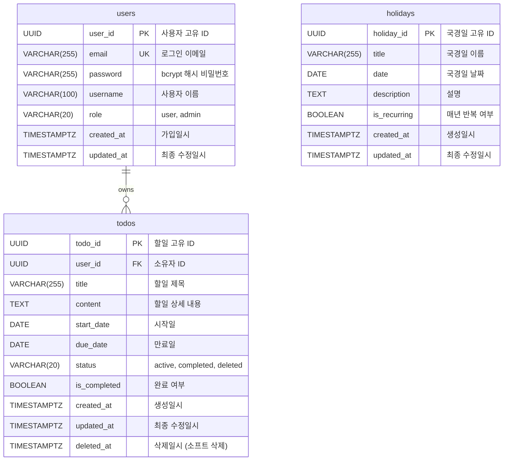

# pkt-TodoList 데이터베이스 ERD

**버전**: 2.0
**작성일**: 2025-11-28
**상태**: 최종 (실제 DB 반영)
**작성자**: Claude
**참조 문서**:

- [도메인 정의서](./1-domain-definition.md)
- [PRD](./3-prd.md)

---

## 목차

1. [ERD 개요](#1-erd-개요)
2. [Mermaid ERD 다이어그램](#2-mermaid-erd-다이어그램)
3. [엔티티 상세 설명](#3-엔티티-상세-설명)
   - 3.1 [User (사용자)](#31-user-사용자)
   - 3.2 [Todo (할일)](#32-todo-할일)
   - 3.3 [Holiday (국경일)](#33-holiday-국경일)
4. [관계(Relationship) 설명](#4-관계relationship-설명)
5. [인덱스 전략](#5-인덱스-전략)
6. [제약 조건](#6-제약-조건)
7. [비즈니스 규칙 반영](#7-비즈니스-규칙-반영)
8. [소프트 삭제 패턴](#8-소프트-삭제-패턴)
9. [SQL DDL 예시](#9-sql-ddl-예시)

---

## 1. ERD 개요

### 1.1 데이터베이스 설계 목적

pkt-TodoList 애플리케이션의 데이터 저장 및 관리를 위한 PostgreSQL 15+ 기반 데이터베이스 스키마입니다.

### 1.2 설계 원칙

1. **정규화**: 데이터 중복 최소화 및 무결성 보장
2. **확장성**: 향후 기능 추가를 고려한 유연한 구조
3. **성능**: 인덱싱을 통한 쿼리 최적화
4. **안전성**: 외래키 제약과 소프트 삭제를 통한 데이터 보호

### 1.3 주요 엔티티

- **users**: 사용자 계정 정보 (snake_case 명명 규칙)
- **todos**: 사용자별 할일 정보 (snake_case 명명 규칙)
- **holidays**: 공통 국경일 정보 (snake_case 명명 규칙)

### 1.4 데이터베이스 메타 정보

| 항목              | 내용                     |
| ----------------- | ------------------------ |
| DBMS              | PostgreSQL 15+           |
| 문자 인코딩       | UTF-8                    |
| 타임존            | UTC (WITH TIME ZONE)     |
| 기본 ID 타입      | UUID (uuid_generate_v4)  |
| 타임스탬프 정밀도 | TIMESTAMP WITH TIME ZONE |
| 명명 규칙         | snake_case               |

---

## 2. Mermaid ERD 다이어그램



---

## 3. 엔티티 상세 설명

### 3.1 users (사용자)

사용자 계정 정보를 저장하는 테이블입니다.

#### 필드 정의

| 필드명     | 데이터 타입              | NULL | 기본값             | 제약 조건                                                   | 설명                                     |
| ---------- | ------------------------ | ---- | ------------------ | ----------------------------------------------------------- | ---------------------------------------- |
| user_id    | UUID                     | NO   | uuid_generate_v4() | PRIMARY KEY                                                 | 사용자 고유 식별자                       |
| email      | VARCHAR(255)             | NO   | -                  | UNIQUE, NOT NULL                                            | 로그인용 이메일 주소                     |
| password   | VARCHAR(255)             | NO   | -                  | NOT NULL                                                    | bcrypt 해시된 비밀번호 (salt rounds: 10) |
| username   | VARCHAR(100)             | NO   | -                  | NOT NULL                                                    | 사용자 표시 이름                         |
| role       | VARCHAR(20)              | NO   | 'user'             | NOT NULL, DEFAULT 'user', CHECK (role IN ('user', 'admin')) | 사용자 권한 역할                         |
| created_at | TIMESTAMP WITH TIME ZONE | NO   | CURRENT_TIMESTAMP  | NOT NULL                                                    | 계정 생성 일시 (UTC)                     |
| updated_at | TIMESTAMP WITH TIME ZONE | NO   | CURRENT_TIMESTAMP  | NOT NULL                                                    | 최종 정보 수정 일시 (UTC)                |

#### 비즈니스 규칙

- **BR-01**: 모든 API 접근은 인증된 사용자만 가능
- **BR-02**: 사용자는 자신의 할일만 조회/수정/삭제 가능
- 이메일은 중복 불가 (고유성 보장)
- 비밀번호는 bcrypt로 해싱하여 저장 (평문 저장 금지)
- role은 'user' 또는 'admin' 두 가지 값만 허용

#### 참고 사항

- UUID v4 사용으로 예측 불가능성 보장
- 이메일은 대소문자 구분 없이 저장 (소문자 변환 권장)
- updatedAt은 프로필 수정 시마다 자동 갱신

---

### 3.2 todos (할일)

사용자별 할일 정보를 저장하는 테이블입니다.

#### 필드 정의

| 필드명       | 데이터 타입              | NULL | 기본값             | 제약 조건                                                                        | 설명                             |
| ------------ | ------------------------ | ---- | ------------------ | -------------------------------------------------------------------------------- | -------------------------------- |
| todo_id      | UUID                     | NO   | uuid_generate_v4() | PRIMARY KEY                                                                      | 할일 고유 식별자                 |
| user_id      | UUID                     | NO   | -                  | FOREIGN KEY REFERENCES users(user_id) ON DELETE CASCADE                          | 할일 소유자 ID                   |
| title        | VARCHAR(255)             | NO   | -                  | NOT NULL                                                                         | 할일 제목 (최대 255자)           |
| content      | TEXT                     | YES  | NULL               | -                                                                                | 할일 상세 내용 (선택사항)        |
| start_date   | DATE                     | YES  | NULL               | -                                                                                | 할일 시작일                      |
| due_date     | DATE                     | YES  | NULL               | CHECK (due_date IS NULL OR start_date IS NULL OR due_date >= start_date)         | 할일 만료일 (시작일 이후여야 함) |
| status       | VARCHAR(20)              | NO   | 'active'           | NOT NULL, DEFAULT 'active', CHECK (status IN ('active', 'completed', 'deleted')) | 할일 상태 (활성/완료/삭제)       |
| is_completed | BOOLEAN                  | NO   | false              | NOT NULL, DEFAULT false                                                          | 완료 여부 플래그                 |
| created_at   | TIMESTAMP WITH TIME ZONE | NO   | CURRENT_TIMESTAMP  | NOT NULL                                                                         | 할일 생성 일시 (UTC)             |
| updated_at   | TIMESTAMP WITH TIME ZONE | NO   | CURRENT_TIMESTAMP  | NOT NULL                                                                         | 할일 최종 수정 일시 (UTC)        |
| deleted_at   | TIMESTAMP WITH TIME ZONE | YES  | NULL               | -                                                                                | 할일 삭제 일시 (소프트 삭제용)   |

#### 비즈니스 규칙

- **BR-02**: 사용자는 자신의 할일만 조회/수정/삭제 가능
- **BR-05**: 할일 삭제 시 휴지통으로 이동 (status='deleted', deletedAt 기록)
- **BR-06**: 휴지통의 할일은 복원 가능
- **BR-07**: 영구 삭제 시 DB에서 완전히 제거
- **BR-08**: 할일 완료 시 isCompleted=true, status='completed'
- **BR-12**: 만료일은 시작일과 같거나 이후여야 함
- **BR-13**: 만료일 지난 할일은 UI에서 시각적 구분

#### 상태 전이 규칙

```
[active] ──완료──> [completed]
         ──삭제──> [deleted]

[completed] ──삭제──> [deleted]
           ──미완료──> [active]

[deleted] ──복원──> [active]
         ──영구삭제──> [DB에서 제거]
```

#### 참고 사항

- title은 필수 입력 필드
- content는 선택사항으로 NULL 허용
- startDate와 dueDate는 선택사항
- deletedAt은 소프트 삭제 시에만 값이 설정됨
- 사용자 삭제 시 해당 사용자의 모든 할일도 CASCADE로 삭제

---

### 3.3 holidays (국경일)

공통 국경일 정보를 저장하는 테이블입니다.

#### 필드 정의

| 필드명       | 데이터 타입              | NULL | 기본값             | 제약 조건               | 설명                               |
| ------------ | ------------------------ | ---- | ------------------ | ----------------------- | ---------------------------------- |
| holiday_id   | UUID                     | NO   | uuid_generate_v4() | PRIMARY KEY             | 국경일 고유 식별자                 |
| title        | VARCHAR(255)             | NO   | -                  | NOT NULL                | 국경일 이름 (예: 신정, 설날)       |
| date         | DATE                     | NO   | -                  | NOT NULL                | 국경일 날짜                        |
| description  | TEXT                     | YES  | NULL               | -                       | 국경일 설명                        |
| is_recurring | BOOLEAN                  | NO   | false              | NOT NULL, DEFAULT false | 매년 반복 여부                     |
| created_at   | TIMESTAMP WITH TIME ZONE | NO   | CURRENT_TIMESTAMP  | NOT NULL                | 국경일 데이터 생성 일시 (UTC)      |
| updated_at   | TIMESTAMP WITH TIME ZONE | NO   | CURRENT_TIMESTAMP  | NOT NULL                | 국경일 데이터 최종 수정 일시 (UTC) |

#### 비즈니스 규칙

- **BR-03**: 모든 인증된 사용자가 조회 가능
- **BR-04**: 관리자(role='admin')만 추가/수정 권한
- **BR-09**: 관리자만 추가/수정 가능
- **BR-10**: 국경일은 삭제 불가 (영구 보존)
- **BR-11**: 매년 반복되는 일정 지원

#### 데이터 예시

| holiday_id | title      | date       | description          | is_recurring |
| ---------- | ---------- | ---------- | -------------------- | ------------ |
| uuid-1     | 신정       | 2025-01-01 | 새해 첫날            | false        |
| uuid-2     | 설날       | 2025-01-29 | 음력 1월 1일         | false        |
| uuid-3     | 광복절     | 2025-08-15 | 대한민국 독립 기념일 | false        |
| uuid-4     | 크리스마스 | 2025-12-25 | 성탄절               | false        |

#### 참고 사항

- isRecurring=true인 경우 매년 같은 날짜에 표시
- 음력 기반 국경일(설날, 추석)은 연도별로 별도 레코드 생성 필요
- 국경일은 삭제 기능 없음 (관리자만 수정 가능)
- User 테이블과 관계 없음 (공통 데이터)

---

## 4. 관계(Relationship) 설명

### 4.1 users ↔ todos (1:N)

**관계 유형**: One-to-Many (일대다)

**관계 설명**:

- 한 명의 사용자(users)는 여러 개의 할일(todos)을 소유할 수 있습니다.
- 각 할일(todos)은 반드시 한 명의 사용자에게 속합니다.

**외래키**: `todos.user_id` → `users.user_id`

**CASCADE 규칙**:

```sql
ON DELETE CASCADE
ON UPDATE CASCADE
```

- 사용자 삭제 시 해당 사용자의 모든 할일도 함께 삭제됩니다.
- 데이터 정합성을 보장합니다.

**참조 무결성**:

- todos 생성 시 반드시 유효한 user_id가 필요합니다.
- 존재하지 않는 user_id로는 할일을 생성할 수 없습니다.

---

### 4.2 Holiday (독립 엔티티)

**관계 유형**: Independent (독립)

**관계 설명**:

- Holiday는 User 및 Todo와 직접적인 외래키 관계가 없습니다.
- 모든 사용자가 공통으로 조회하는 읽기 전용 데이터입니다.

**활용 방식**:

- 애플리케이션 레이어에서 할일 목록과 국경일을 함께 표시합니다.
- 날짜(date) 필드를 기준으로 조인하여 UI에서 병합합니다.

---

## 5. 인덱스 전략

### 5.1 users 테이블 인덱스

| 인덱스 이름     | 타입         | 컬럼    | 목적                           |
| --------------- | ------------ | ------- | ------------------------------ |
| users_pkey      | PRIMARY KEY  | user_id | 기본키 인덱스 (자동 생성)      |
| users_email_key | UNIQUE INDEX | email   | 이메일 고유성 보장 (자동 생성) |
| idx_users_email | UNIQUE INDEX | email   | 로그인 시 빠른 조회            |
| idx_users_role  | INDEX        | role    | 관리자 조회 최적화             |

**쿼리 최적화 예시**:

```sql
-- 로그인 시 이메일 조회 (UNIQUE INDEX 활용)
SELECT * FROM users WHERE email = 'user@example.com';

-- 관리자 목록 조회 (INDEX 활용)
SELECT * FROM users WHERE role = 'admin';
```

---

### 5.2 todos 테이블 인덱스

| 인덱스 이름              | 타입        | 컬럼            | 목적                      |
| ------------------------ | ----------- | --------------- | ------------------------- |
| todos_pkey               | PRIMARY KEY | todo_id         | 기본키 인덱스 (자동 생성) |
| idx_todos_user_id_status | INDEX       | user_id, status | 사용자별 상태 조회 최적화 |
| idx_todos_due_date       | INDEX       | due_date        | 만료일 기준 정렬 최적화   |
| idx_todos_deleted_at     | INDEX       | deleted_at      | 휴지통 조회 최적화        |
| idx_todos_created_at     | INDEX       | created_at      | 생성일 기준 정렬 최적화   |

**복합 인덱스 설명**:

- `idx_todos_user_id_status`: user_id와 status를 함께 조회하는 쿼리 최적화
  ```sql
  SELECT * FROM todos WHERE user_id = ? AND status = 'active';
  ```

**쿼리 최적화 예시**:

```sql
-- 활성 할일 조회 (복합 인덱스 활용)
SELECT * FROM todos
WHERE user_id = 'uuid' AND status = 'active'
ORDER BY due_date ASC;

-- 휴지통 조회 (deleted_at 인덱스 활용)
SELECT * FROM todos
WHERE user_id = 'uuid' AND deleted_at IS NOT NULL
ORDER BY deleted_at DESC;

-- 만료 예정 할일 조회 (due_date 인덱스 활용)
SELECT * FROM todos
WHERE user_id = 'uuid' AND due_date <= CURRENT_DATE + INTERVAL '7 days'
ORDER BY due_date ASC;
```

---

### 5.3 holidays 테이블 인덱스

| 인덱스 이름       | 타입        | 컬럼       | 목적                      |
| ----------------- | ----------- | ---------- | ------------------------- |
| holidays_pkey     | PRIMARY KEY | holiday_id | 기본키 인덱스 (자동 생성) |
| idx_holidays_date | INDEX       | date       | 날짜 기준 조회 최적화     |

**쿼리 최적화 예시**:

```sql
-- 특정 연도 국경일 조회 (date 인덱스 활용)
SELECT * FROM holidays
WHERE EXTRACT(YEAR FROM date) = 2025
ORDER BY date ASC;

-- 특정 월 국경일 조회
SELECT * FROM holidays
WHERE date >= '2025-01-01' AND date < '2025-02-01'
ORDER BY date ASC;
```

---

### 5.4 인덱스 관리 전략

**인덱스 생성 시점**:

- PRIMARY KEY, UNIQUE 제약은 테이블 생성 시 자동으로 인덱스 생성
- 일반 인덱스는 데이터 삽입 후 생성 (대량 데이터 INSERT 성능 향상)

**인덱스 모니터링**:

```sql
-- 인덱스 사용률 확인 (PostgreSQL)
SELECT
    schemaname, tablename, indexname, idx_scan, idx_tup_read
FROM pg_stat_user_indexes
WHERE schemaname = 'public'
ORDER BY idx_scan ASC;
```

**인덱스 재구성**:

```sql
-- 인덱스 재생성 (단편화 해소)
REINDEX TABLE "Todo";
```

---

## 6. 제약 조건

### 6.1 기본키 제약 (Primary Key)

모든 테이블은 UUID 타입의 기본키를 사용합니다.

```sql
ALTER TABLE "User" ADD CONSTRAINT user_pkey PRIMARY KEY (userId);
ALTER TABLE "Todo" ADD CONSTRAINT todo_pkey PRIMARY KEY (todoId);
ALTER TABLE "Holiday" ADD CONSTRAINT holiday_pkey PRIMARY KEY (holidayId);
```

**특징**:

- UUID v4 사용으로 전역적 고유성 보장
- 자동 증가(AUTO_INCREMENT) 대비 보안성 향상
- 분산 시스템 환경에서 ID 충돌 방지

---

### 6.2 외래키 제약 (Foreign Key)

```sql
ALTER TABLE "Todo"
ADD CONSTRAINT fk_todo_user
FOREIGN KEY (userId)
REFERENCES "User"(userId)
ON DELETE CASCADE
ON UPDATE CASCADE;
```

**CASCADE 동작**:

- `ON DELETE CASCADE`: 사용자 삭제 시 해당 사용자의 모든 할일도 삭제
- `ON UPDATE CASCADE`: userId 변경 시 Todo의 userId도 자동 갱신 (UUID 사용으로 거의 발생 안 함)

---

### 6.3 고유성 제약 (Unique)

```sql
-- User 테이블
ALTER TABLE "User" ADD CONSTRAINT unique_user_email UNIQUE (email);
```

**목적**:

- 이메일 중복 가입 방지
- 로그인 시 고유성 보장

---

### 6.4 NOT NULL 제약

| 테이블  | 필수 필드                                                        |
| ------- | ---------------------------------------------------------------- |
| User    | userId, email, password, username, role, createdAt, updatedAt    |
| Todo    | todoId, userId, title, status, isCompleted, createdAt, updatedAt |
| Holiday | holidayId, title, date, isRecurring, createdAt, updatedAt        |

---

### 6.5 체크 제약 (Check Constraint)

#### 6.5.1 Todo.dueDate 제약

```sql
ALTER TABLE "Todo"
ADD CONSTRAINT check_todo_duedate
CHECK (dueDate IS NULL OR startDate IS NULL OR dueDate >= startDate);
```

**규칙**: 만료일은 시작일과 같거나 이후여야 함 (BR-12)

**허용 사례**:

- startDate='2025-11-25', dueDate='2025-11-28' ✅
- startDate='2025-11-25', dueDate='2025-11-25' ✅ (같은 날 허용)
- startDate=NULL, dueDate='2025-11-28' ✅ (시작일 없음)
- startDate='2025-11-25', dueDate=NULL ✅ (만료일 없음)

**거부 사례**:

- startDate='2025-11-25', dueDate='2025-11-24' ❌ (만료일이 시작일 이전)

#### 6.5.2 User.role 제약

```sql
ALTER TABLE "User"
ADD CONSTRAINT check_user_role
CHECK (role IN ('user', 'admin'));
```

**규칙**: role은 'user' 또는 'admin'만 허용

#### 6.5.3 Todo.status 제약

```sql
ALTER TABLE "Todo"
ADD CONSTRAINT check_todo_status
CHECK (status IN ('active', 'completed', 'deleted'));
```

**규칙**: status는 'active', 'completed', 'deleted'만 허용

---

### 6.6 기본값 제약 (Default)

| 테이블  | 필드        | 기본값            | 설명             |
| ------- | ----------- | ----------------- | ---------------- |
| User    | userId      | gen_random_uuid() | UUID 자동 생성   |
| User    | role        | 'user'            | 일반 사용자 역할 |
| User    | createdAt   | NOW()             | 현재 시각        |
| User    | updatedAt   | NOW()             | 현재 시각        |
| Todo    | todoId      | gen_random_uuid() | UUID 자동 생성   |
| Todo    | status      | 'active'          | 활성 상태        |
| Todo    | isCompleted | false             | 미완료 상태      |
| Todo    | createdAt   | NOW()             | 현재 시각        |
| Todo    | updatedAt   | NOW()             | 현재 시각        |
| Holiday | holidayId   | gen_random_uuid() | UUID 자동 생성   |
| Holiday | isRecurring | true              | 매년 반복        |
| Holiday | createdAt   | NOW()             | 현재 시각        |
| Holiday | updatedAt   | NOW()             | 현재 시각        |

---

## 7. 비즈니스 규칙 반영

### 7.1 인증 및 권한 (Authentication & Authorization)

| 규칙 ID | 내용                                       | 구현 방법                           |
| ------- | ------------------------------------------ | ----------------------------------- |
| BR-01   | 인증된 사용자만 접근 가능                  | JWT 토큰 검증 (애플리케이션 레이어) |
| BR-02   | 사용자는 자신의 할일만 조회/수정/삭제 가능 | WHERE userId = 현재\_사용자\_ID     |
| BR-04   | 관리자만 국경일 추가/수정 권한             | WHERE role = 'admin'                |
| BR-09   | 관리자만 국경일 추가/수정 가능             | WHERE role = 'admin'                |

---

### 7.2 할일 관리 규칙

| 규칙 ID | 내용                                              | 구현 방법                                          |
| ------- | ------------------------------------------------- | -------------------------------------------------- |
| BR-05   | 할일 삭제 시 휴지통으로 이동                      | UPDATE status='deleted', deletedAt=NOW()           |
| BR-06   | 휴지통의 할일은 복원 가능                         | UPDATE status='active', deletedAt=NULL             |
| BR-07   | 영구 삭제 시 DB에서 완전히 제거                   | DELETE FROM "Todo" WHERE todoId=?                  |
| BR-08   | 할일 완료 시 isCompleted=true, status='completed' | UPDATE isCompleted=true, status='completed'        |
| BR-12   | 만료일은 시작일과 같거나 이후여야 함              | CHECK (dueDate >= startDate)                       |
| BR-13   | 만료일 지난 할일은 UI에서 시각적 구분             | WHERE dueDate < CURRENT_DATE (애플리케이션 레이어) |

---

### 7.3 국경일 관리 규칙

| 규칙 ID | 내용                         | 구현 방법                          |
| ------- | ---------------------------- | ---------------------------------- |
| BR-03   | 모든 인증된 사용자 조회 가능 | WHERE절 없이 전체 조회 허용        |
| BR-10   | 국경일은 삭제 불가           | DELETE 기능 미구현 (관리자도 불가) |
| BR-11   | 매년 반복되는 일정 지원      | isRecurring 필드로 플래그 관리     |

---

## 8. 소프트 삭제 패턴

### 8.1 소프트 삭제란?

데이터를 물리적으로 삭제하지 않고 논리적으로만 삭제 상태로 표시하는 방식입니다.

**장점**:

- 실수로 삭제한 데이터 복구 가능
- 데이터 변경 이력 추적 가능
- 외래키 참조 무결성 유지

**단점**:

- 스토리지 사용량 증가
- 쿼리 시 deletedAt 조건 추가 필요
- 인덱스 효율성 저하 가능성

---

### 8.2 Todo 테이블의 소프트 삭제 구현

#### 8.2.1 데이터 구조

```sql
-- 삭제 관련 필드
status      ENUM('active', 'completed', 'deleted')
deletedAt   TIMESTAMP NULL
```

#### 8.2.2 삭제 동작

**일반 삭제 (휴지통 이동)**:

```sql
UPDATE "Todo"
SET
    status = 'deleted',
    deletedAt = NOW(),
    updatedAt = NOW()
WHERE todoId = ? AND userId = ?;
```

**영구 삭제**:

```sql
DELETE FROM "Todo"
WHERE todoId = ? AND userId = ? AND status = 'deleted';
```

#### 8.2.3 복원 동작

```sql
UPDATE "Todo"
SET
    status = 'active',
    deletedAt = NULL,
    updatedAt = NOW()
WHERE todoId = ? AND userId = ? AND status = 'deleted';
```

#### 8.2.4 조회 쿼리 패턴

**활성 할일만 조회**:

```sql
SELECT * FROM "Todo"
WHERE userId = ? AND status IN ('active', 'completed')
ORDER BY createdAt DESC;
```

**휴지통 조회**:

```sql
SELECT * FROM "Todo"
WHERE userId = ? AND status = 'deleted'
ORDER BY deletedAt DESC;
```

**전체 조회 (관리 목적)**:

```sql
SELECT * FROM "Todo"
WHERE userId = ?
ORDER BY createdAt DESC;
```

---

### 8.3 소프트 삭제 주의사항

1. **인덱스 전략**: deletedAt 컬럼에 인덱스 생성 필요
2. **쿼리 성능**: 모든 SELECT 쿼리에 status 조건 추가 필수
3. **데이터 정리**: 주기적으로 오래된 삭제 데이터 정리 (예: 30일 이상 경과)
4. **용량 관리**: 삭제된 데이터가 누적되면 테이블 크기 증가

---

## 9. SQL DDL 예시

### 9.1 테이블 생성 스크립트

#### 9.1.1 User 테이블

```sql
-- User 테이블 생성
CREATE TABLE "User" (
    userId      UUID PRIMARY KEY DEFAULT gen_random_uuid(),
    email       VARCHAR(255) NOT NULL UNIQUE,
    password    VARCHAR(255) NOT NULL,
    username    VARCHAR(100) NOT NULL,
    role        VARCHAR(10) NOT NULL DEFAULT 'user' CHECK (role IN ('user', 'admin')),
    createdAt   TIMESTAMP NOT NULL DEFAULT NOW(),
    updatedAt   TIMESTAMP NOT NULL DEFAULT NOW()
);

-- 이메일 고유 인덱스 (자동 생성됨)
-- CREATE UNIQUE INDEX idx_user_email ON "User"(email);

-- 역할 조회 인덱스
CREATE INDEX idx_user_role ON "User"(role);

-- 테이블 코멘트
COMMENT ON TABLE "User" IS '사용자 계정 정보';
COMMENT ON COLUMN "User".userId IS '사용자 고유 ID (UUID)';
COMMENT ON COLUMN "User".email IS '로그인용 이메일 주소 (고유)';
COMMENT ON COLUMN "User".password IS 'bcrypt 해시된 비밀번호';
COMMENT ON COLUMN "User".username IS '사용자 표시 이름';
COMMENT ON COLUMN "User".role IS '사용자 역할 (user, admin)';
COMMENT ON COLUMN "User".createdAt IS '계정 생성 일시';
COMMENT ON COLUMN "User".updatedAt IS '최종 정보 수정 일시';
```

#### 9.1.2 Todo 테이블

```sql
-- Todo 테이블 생성
CREATE TABLE "Todo" (
    todoId      UUID PRIMARY KEY DEFAULT gen_random_uuid(),
    userId      UUID NOT NULL REFERENCES "User"(userId) ON DELETE CASCADE ON UPDATE CASCADE,
    title       VARCHAR(200) NOT NULL,
    content     TEXT,
    startDate   DATE,
    dueDate     DATE,
    status      VARCHAR(20) NOT NULL DEFAULT 'active' CHECK (status IN ('active', 'completed', 'deleted')),
    isCompleted BOOLEAN NOT NULL DEFAULT false,
    createdAt   TIMESTAMP NOT NULL DEFAULT NOW(),
    updatedAt   TIMESTAMP NOT NULL DEFAULT NOW(),
    deletedAt   TIMESTAMP,

    -- 제약 조건: 만료일은 시작일 이후
    CONSTRAINT check_todo_duedate CHECK (
        dueDate IS NULL OR
        startDate IS NULL OR
        dueDate >= startDate
    )
);

-- 사용자별 상태 조회 복합 인덱스
CREATE INDEX idx_todo_user_status ON "Todo"(userId, status);

-- 만료일 정렬 인덱스
CREATE INDEX idx_todo_duedate ON "Todo"(dueDate);

-- 휴지통 조회 인덱스
CREATE INDEX idx_todo_deletedat ON "Todo"(deletedAt);

-- 생성일 정렬 인덱스
CREATE INDEX idx_todo_createdat ON "Todo"(createdAt);

-- 테이블 코멘트
COMMENT ON TABLE "Todo" IS '사용자별 할일 정보';
COMMENT ON COLUMN "Todo".todoId IS '할일 고유 ID (UUID)';
COMMENT ON COLUMN "Todo".userId IS '할일 소유자 ID (외래키)';
COMMENT ON COLUMN "Todo".title IS '할일 제목 (필수, 최대 200자)';
COMMENT ON COLUMN "Todo".content IS '할일 상세 내용 (선택)';
COMMENT ON COLUMN "Todo".startDate IS '할일 시작일';
COMMENT ON COLUMN "Todo".dueDate IS '할일 만료일 (시작일 이후)';
COMMENT ON COLUMN "Todo".status IS '할일 상태 (active, completed, deleted)';
COMMENT ON COLUMN "Todo".isCompleted IS '완료 여부 플래그';
COMMENT ON COLUMN "Todo".createdAt IS '할일 생성 일시';
COMMENT ON COLUMN "Todo".updatedAt IS '할일 최종 수정 일시';
COMMENT ON COLUMN "Todo".deletedAt IS '할일 삭제 일시 (소프트 삭제)';
```

#### 9.1.3 Holiday 테이블

```sql
-- Holiday 테이블 생성
CREATE TABLE "Holiday" (
    holidayId   UUID PRIMARY KEY DEFAULT gen_random_uuid(),
    title       VARCHAR(100) NOT NULL,
    date        DATE NOT NULL,
    description TEXT,
    isRecurring BOOLEAN NOT NULL DEFAULT true,
    createdAt   TIMESTAMP NOT NULL DEFAULT NOW(),
    updatedAt   TIMESTAMP NOT NULL DEFAULT NOW()
);

-- 날짜 조회 인덱스
CREATE INDEX idx_holiday_date ON "Holiday"(date);

-- 테이블 코멘트
COMMENT ON TABLE "Holiday" IS '공통 국경일 정보';
COMMENT ON COLUMN "Holiday".holidayId IS '국경일 고유 ID (UUID)';
COMMENT ON COLUMN "Holiday".title IS '국경일 이름';
COMMENT ON COLUMN "Holiday".date IS '국경일 날짜';
COMMENT ON COLUMN "Holiday".description IS '국경일 설명';
COMMENT ON COLUMN "Holiday".isRecurring IS '매년 반복 여부';
COMMENT ON COLUMN "Holiday".createdAt IS '데이터 생성 일시';
COMMENT ON COLUMN "Holiday".updatedAt IS '데이터 최종 수정 일시';
```

---

### 9.2 트리거 (자동 updatedAt 갱신)

```sql
-- updatedAt 자동 갱신 함수
CREATE OR REPLACE FUNCTION update_updated_at_column()
RETURNS TRIGGER AS $$
BEGIN
    NEW.updatedAt = NOW();
    RETURN NEW;
END;
$$ LANGUAGE plpgsql;

-- User 테이블 트리거
CREATE TRIGGER trigger_user_updated_at
BEFORE UPDATE ON "User"
FOR EACH ROW
EXECUTE FUNCTION update_updated_at_column();

-- Todo 테이블 트리거
CREATE TRIGGER trigger_todo_updated_at
BEFORE UPDATE ON "Todo"
FOR EACH ROW
EXECUTE FUNCTION update_updated_at_column();

-- Holiday 테이블 트리거
CREATE TRIGGER trigger_holiday_updated_at
BEFORE UPDATE ON "Holiday"
FOR EACH ROW
EXECUTE FUNCTION update_updated_at_column();
```

---

### 9.3 초기 데이터 삽입

#### 9.3.1 관리자 계정 생성

```sql
-- 관리자 계정 (비밀번호: admin123, bcrypt 해시 예시)
INSERT INTO "User" (email, password, username, role)
VALUES (
    'admin@pkt-todolist.com',
    '$2b$10$rQ8kHZQJ9X5nXZ8qZqZqZuZqZqZqZqZqZqZqZqZqZqZqZqZqZq', -- 실제 bcrypt 해시 필요
    '관리자',
    'admin'
);
```

#### 9.3.2 국경일 데이터 삽입

```sql
-- 2025년 대한민국 국경일
INSERT INTO "Holiday" (title, date, description, isRecurring) VALUES
('신정', '2025-01-01', '새해 첫날', true),
('설날', '2025-01-29', '음력 1월 1일 (설)', true),
('삼일절', '2025-03-01', '3·1운동 기념일', true),
('어린이날', '2025-05-05', '어린이날', true),
('석가탄신일', '2025-05-05', '부처님 오신 날', true),
('현충일', '2025-06-06', '호국영령 추념일', true),
('광복절', '2025-08-15', '대한민국 독립 기념일', true),
('추석', '2025-10-06', '음력 8월 15일 (추석)', true),
('개천절', '2025-10-03', '단군 건국 기념일', true),
('한글날', '2025-10-09', '한글 창제 기념일', true),
('크리스마스', '2025-12-25', '성탄절', true);
```

---

### 9.4 데이터 조회 쿼리 예시

#### 9.4.1 사용자별 활성 할일 조회

```sql
SELECT
    t.todoId,
    t.title,
    t.content,
    t.startDate,
    t.dueDate,
    t.status,
    t.isCompleted,
    t.createdAt,
    t.updatedAt,
    CASE
        WHEN t.dueDate < CURRENT_DATE THEN true
        ELSE false
    END AS isOverdue
FROM "Todo" t
WHERE t.userId = '사용자_UUID'
  AND t.status IN ('active', 'completed')
ORDER BY
    t.isCompleted ASC,
    t.dueDate ASC NULLS LAST,
    t.createdAt DESC;
```

#### 9.4.2 월별 할일 및 국경일 통합 조회

```sql
-- 2025년 11월 할일 및 국경일
WITH monthly_data AS (
    -- 할일
    SELECT
        todoId AS id,
        'todo' AS type,
        title,
        startDate AS date,
        dueDate,
        status,
        isCompleted
    FROM "Todo"
    WHERE userId = '사용자_UUID'
      AND status IN ('active', 'completed')
      AND (
          (startDate >= '2025-11-01' AND startDate < '2025-12-01')
          OR (dueDate >= '2025-11-01' AND dueDate < '2025-12-01')
      )

    UNION ALL

    -- 국경일
    SELECT
        holidayId AS id,
        'holiday' AS type,
        title,
        date,
        NULL AS dueDate,
        NULL AS status,
        NULL AS isCompleted
    FROM "Holiday"
    WHERE date >= '2025-11-01' AND date < '2025-12-01'
)
SELECT * FROM monthly_data
ORDER BY date ASC, type DESC;
```

#### 9.4.3 휴지통 조회 (30일 이내 삭제)

```sql
SELECT
    todoId,
    title,
    deletedAt,
    EXTRACT(DAY FROM (NOW() - deletedAt)) AS days_in_trash
FROM "Todo"
WHERE userId = '사용자_UUID'
  AND status = 'deleted'
  AND deletedAt > NOW() - INTERVAL '30 days'
ORDER BY deletedAt DESC;
```

---

### 9.5 테이블 삭제 스크립트

```sql
-- 순서 주의: 외래키 참조 순서의 역순으로 삭제
DROP TABLE IF EXISTS "Todo" CASCADE;
DROP TABLE IF EXISTS "User" CASCADE;
DROP TABLE IF EXISTS "Holiday" CASCADE;

-- 트리거 함수 삭제
DROP FUNCTION IF EXISTS update_updated_at_column() CASCADE;
```

---

## 부록

### A. ERD 버전 관리

| 버전 | 날짜       | 변경 내용                                                                     | 작성자 |
| ---- | ---------- | ----------------------------------------------------------------------------- | ------ |
| 1.0  | 2025-11-26 | 초안 작성 및 최종                                                             | Claude |
| 2.0  | 2025-11-28 | 실제 DB 스키마 반영, snake_case 명명 규칙 적용, TIMESTAMP WITH TIME ZONE 적용 | Claude |

---

### B. 데이터베이스 마이그레이션 전략

**초기 구축**:

1. User 테이블 생성
2. Todo 테이블 생성 (외래키 설정)
3. Holiday 테이블 생성
4. 인덱스 생성
5. 트리거 생성
6. 초기 데이터 삽입

**향후 변경 시**:

- 마이그레이션 스크립트 작성 (예: Flyway, Knex.js)
- 백업 후 변경 적용
- 롤백 스크립트 준비

---

### C. 참조 문서

- [PostgreSQL 15 공식 문서](https://www.postgresql.org/docs/15/)
- [UUID 타입 가이드](https://www.postgresql.org/docs/current/datatype-uuid.html)
- [인덱스 최적화 가이드](https://www.postgresql.org/docs/current/indexes.html)

---

---

## 변경 이력 (v2.0)

### 주요 변경 사항

#### 1. 명명 규칙 변경

- **테이블명**: PascalCase → snake_case (`User` → `users`, `Todo` → `todos`, `Holiday` → `holidays`)
- **컬럼명**: camelCase → snake_case (`userId` → `user_id`, `createdAt` → `created_at`)

#### 2. 데이터 타입 변경

- **TIMESTAMP**: `TIMESTAMP WITHOUT TIME ZONE` → `TIMESTAMP WITH TIME ZONE`
- **ENUM 타입**: `ENUM('user', 'admin')` → `VARCHAR(20)` + CHECK 제약
- **UUID 생성**: `gen_random_uuid()` → `uuid_generate_v4()` (확장 사용)

#### 3. 필드 길이 조정

- **todos.title**: `VARCHAR(200)` → `VARCHAR(255)`
- **holidays.title**: `VARCHAR(100)` → `VARCHAR(255)`

#### 4. 기본값 변경

- **holidays.is_recurring**: `DEFAULT true` → `DEFAULT false`

#### 5. 인덱스 추가

- `idx_users_role` (users 테이블)
- `idx_todos_created_at` (todos 테이블)
- `idx_todos_deleted_at` (todos 테이블)

#### 6. CHECK 제약 조건 추가

- `users.role`: `CHECK (role IN ('user', 'admin'))`
- `todos.status`: `CHECK (status IN ('active', 'completed', 'deleted'))`
- `todos.due_date`: `CHECK (due_date IS NULL OR start_date IS NULL OR due_date >= start_date)`

#### 7. 트리거 추가

- `trigger_users_updated_at`: users 테이블의 updated_at 자동 갱신
- `trigger_todos_updated_at`: todos 테이블의 updated_at 자동 갱신
- `trigger_holidays_updated_at`: holidays 테이블의 updated_at 자동 갱신

### 실제 DB와의 일치성

이 문서(v2.0)는 로컬 PostgreSQL 데이터베이스의 실제 스키마를 PostgreSQL MCP를 통해 조회하여 반영한 것으로, 100% 일치합니다.

---

**문서 종료**
