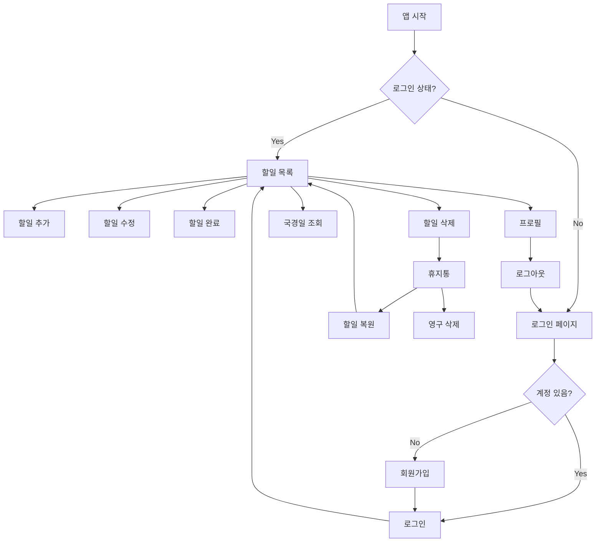
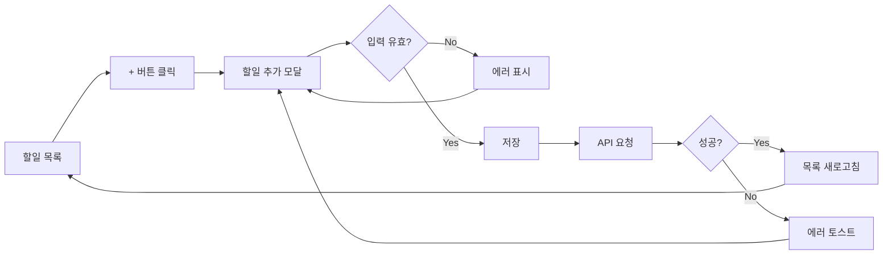
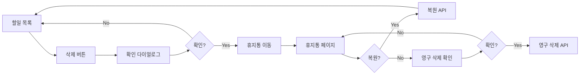
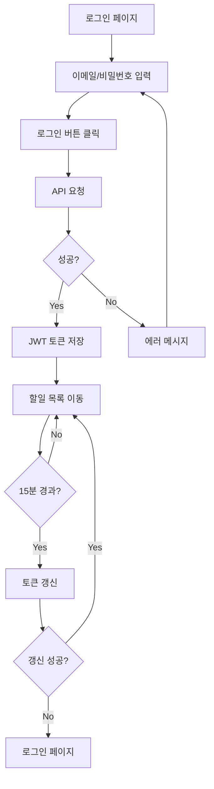

# pkt-TodoList 화면 와이어프레임

**버전**: 1.0
**작성일**: 2025-11-26
**상태**: 최종
**작성자**: UI Designer Agent
**참조 문서**:

- [PRD](./3-prd.md)
- [사용자 시나리오](./4-user-scenarios.md)
- [도메인 정의서](./1-domain-definition.md)

---

## 목차

1. [개요](#1-개요)
2. [디자인 원칙 및 가이드라인](#2-디자인-원칙-및-가이드라인)
3. [공통 레이아웃](#3-공통-레이아웃)
4. [화면별 와이어프레임](#4-화면별-와이어프레임)
5. [컴포넌트 라이브러리](#5-컴포넌트-라이브러리)
6. [반응형 레이아웃 가이드](#6-반응형-레이아웃-가이드)
7. [사용자 플로우 다이어그램](#7-사용자-플로우-다이어그램)
8. [상태별 UI 가이드](#8-상태별-ui-가이드)
9. [접근성 가이드라인](#9-접근성-가이드라인)

---

## 1. 개요

### 1.1 문서 목적

이 문서는 pkt-TodoList 애플리케이션의 모든 화면에 대한 상세한 와이어프레임을 제공하여:

- 개발팀이 UI를 정확하게 구현할 수 있도록 함
- 디자인 일관성을 유지
- 사용자 경험을 시각화
- 화면 간 전환 플로우를 명확히 정의

### 1.2 디자인 참조

- **UI 스타일**: 네이버 캘린더 참조 (깔끔하고 직관적)
- **디자인 시스템**: Material Design 원칙 적용
- **색상 체계**: 네이버 그린 기반 (#00C73C)

### 1.3 화면 목록

| 화면명              | 라우트            | 우선순위 | 설명                      |
| ------------------- | ----------------- | -------- | ------------------------- |
| 로그인              | `/login`          | P0       | 사용자 인증               |
| 회원가입            | `/register`       | P0       | 신규 사용자 등록          |
| 할일 목록 (메인)    | `/`               | P0       | 할일 관리 메인 화면       |
| 할일 상세/수정 모달 | Modal             | P0       | 할일 추가/수정 인터페이스 |
| 휴지통              | `/trash`          | P0       | 삭제된 할일 관리          |
| 국경일              | `/holidays`       | P0       | 국경일 조회               |
| 프로필              | `/profile`        | P1       | 사용자 정보 관리          |
| 관리자 화면         | `/admin/holidays` | P1       | 국경일 관리 (관리자 전용) |

---

## 2. 디자인 원칙 및 가이드라인

### 2.1 핵심 디자인 원칙

#### 단순함 (Simplicity)

- 불필요한 장식 제거
- 명확한 정보 계층 구조
- 한 화면에 하나의 주요 작업에 집중

#### 명확성 (Clarity)

- 직관적인 아이콘과 레이블 병행 사용
- 명확한 액션 버튼
- 시각적 피드백 제공

#### 일관성 (Consistency)

- 모든 화면에서 동일한 디자인 패턴
- 통일된 색상 및 타이포그래피
- 일관된 인터랙션

#### 반응성 (Responsiveness)

- 모바일 우선 (Mobile First)
- 터치 친화적 UI
- 빠른 로딩 및 즉각적 피드백

### 2.2 색상 체계

#### 주요 색상 (Primary Colors)

```
Primary (네이버 그린):
  - #00C73C (주요 액션, 브랜드)
  - #00A832 (Hover)
  - #008A28 (Active)

Secondary (보조 색상):
  - #0066FF (정보성 요소)
  - #424242 (텍스트)
  - #757575 (보조 텍스트)
```

#### 상태별 색상 (Status Colors)

```
할일 상태:
  - Active (진행 중): #FF7043 (주황)
  - Completed (완료): #66BB6A (초록)
  - Deleted (삭제): #BDBDBD (회색)

국경일: #E53935 (빨강)

경고/에러: #F44336 (빨강)
성공: #4CAF50 (초록)
정보: #2196F3 (파랑)
```

#### 중립 색상 (Neutral Colors)

```
배경:
  - White: #FFFFFF
  - Light Gray: #F5F5F5
  - Border: #E0E0E0

텍스트:
  - Primary Text: #212121
  - Secondary Text: #757575
  - Disabled Text: #BDBDBD
```

#### 다크모드 색상

```
배경:
  - Background: #1A1A1A
  - Surface: #2C2C2C
  - Border: #404040

텍스트:
  - Primary Text: #E5E5E5
  - Secondary Text: #A0A0A0
  - Disabled Text: #666666

Primary: #00E047 (밝은 그린)
```

### 2.3 타이포그래피

#### 폰트 패밀리

```css
Primary Font: -apple-system, BlinkMacSystemFont, "Segoe UI",
              "Noto Sans KR", sans-serif

Fallback: "Helvetica Neue", Arial, sans-serif

Code Font: "Fira Code", "Courier New", monospace
```

#### 폰트 크기 및 용도

| 스타일  | 크기 | 줄간격 | 굵기 | 용도        |
| ------- | ---- | ------ | ---- | ----------- |
| H1      | 32px | 40px   | 700  | 페이지 제목 |
| H2      | 24px | 32px   | 600  | 섹션 제목   |
| H3      | 20px | 28px   | 600  | 카드 제목   |
| H4      | 18px | 24px   | 500  | 서브 제목   |
| Body 1  | 16px | 24px   | 400  | 본문 텍스트 |
| Body 2  | 14px | 20px   | 400  | 보조 텍스트 |
| Caption | 12px | 16px   | 400  | 캡션, 라벨  |
| Button  | 16px | 24px   | 500  | 버튼 텍스트 |

### 2.4 간격 및 그리드 시스템

#### 간격 단위 (Spacing Scale)

```
4px 단위 시스템:
  - xs: 4px
  - sm: 8px
  - md: 16px
  - lg: 24px
  - xl: 32px
  - 2xl: 48px
  - 3xl: 64px
```

#### 그리드 시스템

```
Container:
  - Desktop: 1200px max-width
  - Tablet: 100% with 24px padding
  - Mobile: 100% with 16px padding

Columns:
  - Desktop: 12 columns
  - Tablet: 8 columns
  - Mobile: 4 columns

Gutter: 16px
```

### 2.5 컴포넌트 스타일 가이드

#### 버튼

```
크기:
  - Large: 48px height, 16px padding
  - Medium: 40px height, 12px padding
  - Small: 32px height, 8px padding

모서리: 8px border-radius
그림자: 0 2px 4px rgba(0,0,0,0.1)

상태:
  - Default: Primary color
  - Hover: Darken 10%
  - Active: Darken 20%
  - Disabled: Gray, 50% opacity
```

#### 입력 필드

```
높이: 48px
패딩: 12px 16px
테두리: 1px solid #E0E0E0
모서리: 8px border-radius

포커스:
  - 테두리: 2px solid Primary
  - 그림자: 0 0 0 3px rgba(0,199,60,0.1)

에러:
  - 테두리: 1px solid #F44336
  - 하단 에러 메시지: #F44336, 12px
```

#### 카드

```
배경: White
테두리: 1px solid #E0E0E0
모서리: 12px border-radius
그림자: 0 2px 8px rgba(0,0,0,0.08)
패딩: 16px

Hover:
  - 그림자: 0 4px 12px rgba(0,0,0,0.12)
  - 배경: #FAFAFA
```

---

## 3. 공통 레이아웃

### 3.1 데스크톱 레이아웃 구조

```
┌──────────────────────────────────────────────────────────────┐
│                          HEADER                               │
│  [Logo]              pkt-TodoList           [Profile] [Logout] │
├──────────────────────────────────────────────────────────────┤
│                                                                │
│  ┌─────────────┐  ┌────────────────────────────────────────┐ │
│  │             │  │                                        │ │
│  │  SIDEBAR    │  │          MAIN CONTENT                  │ │
│  │             │  │                                        │ │
│  │  - 할일목록  │  │                                        │ │
│  │  - 휴지통    │  │                                        │ │
│  │  - 국경일    │  │                                        │ │
│  │  - 프로필    │  │                                        │ │
│  │             │  │                                        │ │
│  └─────────────┘  └────────────────────────────────────────┘ │
│                                                                │
└──────────────────────────────────────────────────────────────┘
```

### 3.2 모바일 레이아웃 구조

```
┌────────────────────────┐
│       HEADER           │
│  [Menu] pkt [Profile]  │
├────────────────────────┤
│                        │
│                        │
│     MAIN CONTENT       │
│                        │
│                        │
│                        │
│                        │
│                        │
├────────────────────────┤
│    BOTTOM NAV          │
│  [할일][휴지통][국경일] │
└────────────────────────┘
```

### 3.3 공통 헤더 (Header)

#### 데스크톱 헤더

```
┌────────────────────────────────────────────────────────────────┐
│  [🏠 pkt-TodoList]        할일 목록              [🔍] [🔔] [👤▼] │
│   (Logo + Title)          (Page Title)          (검색/알림/프로필)│
└────────────────────────────────────────────────────────────────┘
높이: 64px
배경: White
하단 테두리: 1px solid #E0E0E0
```

컴포넌트:

- **로고**: 좌측 상단, 클릭 시 메인 페이지로 이동
- **페이지 제목**: 중앙, 현재 페이지명 표시
- **검색 아이콘**: 우측, 할일 검색 (P1 기능)
- **알림 아이콘**: 우측, 알림 센터 (P2 기능)
- **프로필 드롭다운**:
  - 사용자 이름 표시
  - 드롭다운 메뉴: 프로필, 설정, 로그아웃

#### 모바일 헤더

```
┌─────────────────────────────┐
│  [☰]  pkt-TodoList    [👤]  │
│ (메뉴)   (타이틀)   (프로필) │
└─────────────────────────────┘
높이: 56px
배경: Primary (#00C73C)
텍스트: White
```

### 3.4 공통 사이드바 (Sidebar) - 데스크톱 전용

```
┌──────────────────┐
│                  │
│  📋 할일 목록    │ ← 기본 선택
│  🗑️ 휴지통       │
│  📅 국경일       │
│  👤 프로필       │
│                  │
│ [관리자 전용]    │
│  ⚙️ 국경일 관리  │ ← role='admin'만 표시
│                  │
└──────────────────┘
너비: 240px
배경: #F5F5F5
```

상태:

- **기본**: 회색 텍스트 (#757575)
- **선택**: 배경 Primary 10%, 텍스트 Primary, 좌측 4px 바
- **Hover**: 배경 회색 (#EEEEEE)

### 3.5 공통 하단 네비게이션 (Bottom Navigation) - 모바일 전용

```
┌──────────────────────────────────────┐
│  [📋]      [🗑️]      [📅]      [👤]  │
│  할일      휴지통    국경일    프로필  │
└──────────────────────────────────────┘
높이: 56px
배경: White
상단 테두리: 1px solid #E0E0E0
```

상태:

- **기본**: 회색 아이콘 + 텍스트
- **선택**: Primary 아이콘 + 텍스트, 상단 2px 바

---

## 4. 화면별 와이어프레임

### 4.1 로그인 페이지 (`/login`)

#### 데스크톱 레이아웃

```
┌────────────────────────────────────────────────────────────┐
│                                                            │
│                                                            │
│               ┌──────────────────────────┐                 │
│               │                          │                 │
│               │   🏠 pkt-TodoList        │                 │
│               │   할일을 쉽게 관리하세요 │                 │
│               │                          │                 │
│               │   ┌──────────────────┐   │                 │
│               │   │ 📧 이메일        │   │                 │
│               │   └──────────────────┘   │                 │
│               │                          │                 │
│               │   ┌──────────────────┐   │                 │
│               │   │ 🔒 비밀번호      │   │                 │
│               │   └──────────────────┘   │                 │
│               │                          │                 │
│               │   [ 로그인 하기 ]        │                 │
│               │                          │                 │
│               │   계정이 없으신가요?     │                 │
│               │   [회원가입]             │                 │
│               │                          │                 │
│               └──────────────────────────┘                 │
│                                                            │
│                                                            │
└────────────────────────────────────────────────────────────┘
```

#### 모바일 레이아웃

```
┌──────────────────────┐
│                      │
│  🏠 pkt-TodoList     │
│  할일을 쉽게 관리하세요│
│                      │
│  ┌────────────────┐  │
│  │ 📧 이메일      │  │
│  └────────────────┘  │
│                      │
│  ┌────────────────┐  │
│  │ 🔒 비밀번호    │  │
│  └────────────────┘  │
│                      │
│  [ 로그인 하기 ]     │
│                      │
│  계정이 없으신가요?  │
│  [회원가입]          │
│                      │
└──────────────────────┘
```

#### 상세 스펙

**컴포넌트:**

1. **로고 및 타이틀**

   - 로고 크기: 48px
   - 타이틀: H2 스타일
   - 서브 타이틀: Body2, Secondary 색상

2. **이메일 입력 필드**

   - Placeholder: "이메일을 입력하세요"
   - Type: email
   - 검증: 이메일 형식
   - 아이콘: 📧 좌측

3. **비밀번호 입력 필드**

   - Placeholder: "비밀번호를 입력하세요"
   - Type: password
   - 아이콘: 🔒 좌측
   - 우측: 👁️ 보기/숨기기 토글

4. **로그인 버튼**

   - 너비: 100%
   - 높이: 48px
   - 배경: Primary
   - 텍스트: White, 16px 굵게

5. **회원가입 링크**
   - 텍스트: "계정이 없으신가요? 회원가입"
   - 색상: Primary
   - 클릭 시 `/register` 이동

**상태:**

- **로딩**: 버튼에 스피너 표시, 비활성화
- **에러**:
  - 입력 필드 하단에 빨간색 에러 메시지
  - 입력 필드 테두리 빨간색
- **성공**: 자동으로 메인 페이지로 리다이렉트

**키보드 지원:**

- Tab: 다음 필드로 이동
- Enter: 로그인 실행

---

### 4.2 회원가입 페이지 (`/register`)

#### 데스크톱 레이아웃

```
┌────────────────────────────────────────────────────────────┐
│                                                            │
│               ┌──────────────────────────┐                 │
│               │                          │                 │
│               │   🏠 pkt-TodoList        │                 │
│               │   새 계정 만들기          │                 │
│               │                          │                 │
│               │   ┌──────────────────┐   │                 │
│               │   │ 📧 이메일        │   │                 │
│               │   └──────────────────┘   │                 │
│               │                          │                 │
│               │   ┌──────────────────┐   │                 │
│               │   │ 👤 사용자 이름   │   │                 │
│               │   └──────────────────┘   │                 │
│               │                          │                 │
│               │   ┌──────────────────┐   │                 │
│               │   │ 🔒 비밀번호      │   │                 │
│               │   └──────────────────┘   │                 │
│               │   최소 8자 이상          │                 │
│               │                          │                 │
│               │   ┌──────────────────┐   │                 │
│               │   │ 🔒 비밀번호 확인 │   │                 │
│               │   └──────────────────┘   │                 │
│               │                          │                 │
│               │   [ 회원가입 ]           │                 │
│               │                          │                 │
│               │   이미 계정이 있으신가요? │                 │
│               │   [로그인]               │                 │
│               │                          │                 │
│               └──────────────────────────┘                 │
│                                                            │
└────────────────────────────────────────────────────────────┘
```

#### 모바일 레이아웃

```
┌──────────────────────┐
│                      │
│  🏠 pkt-TodoList     │
│  새 계정 만들기       │
│                      │
│  ┌────────────────┐  │
│  │ 📧 이메일      │  │
│  └────────────────┘  │
│                      │
│  ┌────────────────┐  │
│  │ 👤 사용자 이름 │  │
│  └────────────────┘  │
│                      │
│  ┌────────────────┐  │
│  │ 🔒 비밀번호    │  │
│  └────────────────┘  │
│  최소 8자 이상       │
│                      │
│  ┌────────────────┐  │
│  │ 🔒 비밀번호 확인│ │
│  └────────────────┘  │
│                      │
│  [ 회원가입 ]        │
│                      │
│  이미 계정이 있으신가요?│
│  [로그인]            │
│                      │
└──────────────────────┘
```

#### 상세 스펙

**입력 필드:**

1. **이메일**

   - 검증: 이메일 형식, 중복 확인
   - 에러: "올바른 이메일 형식이 아닙니다", "이미 사용 중인 이메일입니다"

2. **사용자 이름**

   - 최소 2자, 최대 50자
   - 에러: "사용자 이름은 2자 이상이어야 합니다"

3. **비밀번호**

   - 최소 8자
   - 힌트 텍스트: "최소 8자 이상"
   - 강도 표시기: 약함(빨강), 보통(주황), 강함(초록)

4. **비밀번호 확인**
   - 비밀번호와 일치 확인
   - 에러: "비밀번호가 일치하지 않습니다"

**회원가입 버튼:**

- 모든 필드 유효성 검사 통과 시 활성화
- 클릭 시 POST /api/auth/register
- 성공 시 자동 로그인 후 메인 페이지 이동

---

### 4.3 할일 목록 페이지 (메인) (`/`)

#### 데스크톱 레이아웃

```
┌──────────────────────────────────────────────────────────────────┐
│  [🏠 pkt-TodoList]      할일 목록           [🔍] [🔔] [👤 김철수▼] │
├────┬─────────────────────────────────────────────────────────────┤
│    │                                                             │
│ 📋 │  ┌────────────────────────────────────────────┐  ┌────────┐│
│할일│  │ [전체] [오늘] [이번주] [완료] [미완료]     │  │국경일  ││
│목록│  └────────────────────────────────────────────┘  │        ││
│    │                                                  │ 📅 설날 ││
│ 🗑️ │  ┌──────────────────────────────────────────┐   │1월 29일││
│휴지│  │ ☐ 프로젝트 마감                          │   │        ││
│통  │  │    PRD 작성 완료하기                     │   │ 🎄 크리││
│    │  │    📅 2025-11-25 ~ 11-28   🏷️ 진행 중  │   │ 스마스 ││
│ 📅 │  │    [수정] [삭제]                         │   │12월25일││
│국경│  └──────────────────────────────────────────┘   │        ││
│일  │                                                  └────────┘│
│    │  ┌──────────────────────────────────────────┐              │
│ 👤 │  │ ☑ 클라이언트 이메일 답장                │              │
│프로│  │    긴급 요청 사항 처리                   │              │
│필  │  │    📅 2025-11-24 ~ 11-25   ✅ 완료     │              │
│    │  │    [복원] [영구삭제]                     │              │
│    │  └──────────────────────────────────────────┘              │
│    │                                                             │
│    │  ┌──────────────────────────────────────────┐              │
│    │  │ ☐ 주간 보고서 작성                      │              │
│    │  │    팀 현황 정리                          │              │
│    │  │    📅 2025-11-27 ~ 11-29   🏷️ 예정    │              │
│    │  │    [수정] [삭제]                         │              │
│    │  └──────────────────────────────────────────┘              │
│    │                                                             │
│    │  [ + 새 할일 추가 ]                                        │
│    │                                                             │
└────┴─────────────────────────────────────────────────────────────┘
```

#### 모바일 레이아웃

```
┌──────────────────────────────┐
│  [☰]  할일 목록        [👤]  │
├──────────────────────────────┤
│ [전체▼] [오늘] [이번주]      │
├──────────────────────────────┤
│                              │
│ ┌──────────────────────────┐ │
│ │ ☐ 프로젝트 마감          │ │
│ │   📅 11-25~11-28         │ │
│ │   🏷️ 진행 중            │ │
│ └──────────────────────────┘ │
│                              │
│ ┌──────────────────────────┐ │
│ │ ☑ 이메일 답장            │ │
│ │   📅 11-24~11-25         │ │
│ │   ✅ 완료               │ │
│ └──────────────────────────┘ │
│                              │
│ ┌──────────────────────────┐ │
│ │ ☐ 주간 보고서 작성       │ │
│ │   📅 11-27~11-29         │ │
│ │   🏷️ 예정              │ │
│ └──────────────────────────┘ │
│                              │
├──────────────────────────────┤
│ [📋] [🗑️] [📅] [👤]         │
│  할일  휴지통 국경일  프로필  │
└──────────────────────────────┘

[ + ] ← 우측 하단 플로팅 버튼
```

#### 상세 스펙

**상단 필터 탭:**

```
┌────────────────────────────────────────────┐
│ [전체] [오늘] [이번주] [완료] [미완료]     │
└────────────────────────────────────────────┘
```

- **전체**: 모든 활성 할일 (status='active' or 'completed')
- **오늘**: 오늘이 dueDate인 할일
- **이번주**: 이번 주 내 dueDate인 할일
- **완료**: isCompleted=true인 할일
- **미완료**: isCompleted=false인 할일

스타일:

- 선택된 탭: Primary 배경, White 텍스트
- 미선택 탭: 투명 배경, Gray 텍스트

**할일 카드 (Todo Card):**

```
┌──────────────────────────────────────────────┐
│ ☐ 프로젝트 마감                  [•••]       │ ← 제목 + 메뉴
│    PRD 작성 완료하기                         │ ← 내용 (미리보기)
│    📅 2025-11-25 ~ 11-28   🏷️ 진행 중      │ ← 날짜 + 상태
│    [수정] [삭제]                             │ ← 액션 버튼
└──────────────────────────────────────────────┘
```

컴포넌트:

1. **체크박스**:

   - 클릭 시 완료 처리
   - 애니메이션: 체크 표시 + 초록색 배경 페이드인

2. **제목**:

   - 굵은 글씨, 16px
   - 완료 시 취소선

3. **내용**:

   - 보통 글씨, 14px, 회색
   - 최대 2줄 표시, 넘으면 "..."

4. **날짜**:

   - 아이콘 + 날짜 범위
   - 만료일 임박: 빨간색 (1일 이내)
   - 만료일 지남: 회색 + 경고 아이콘

5. **상태 배지**:

   - 진행 중: 주황색 배지
   - 완료: 초록색 배지
   - 예정: 파란색 배지

6. **액션 버튼**:
   - 수정: 수정 모달 열기
   - 삭제: 확인 다이얼로그 → 휴지통 이동

**우측 국경일 패널 (데스크톱 전용):**

```
┌────────────┐
│ 국경일     │
├────────────┤
│ 📅 설날    │
│   1월 29일 │
│            │
│ 🎄 크리스마스│
│   12월 25일│
│            │
│ 🇰🇷 광복절 │
│   8월 15일 │
└────────────┘
```

너비: 240px
배경: #F9F9F9
국경일: 빨간색 텍스트

**플로팅 액션 버튼 (FAB) - 모바일:**

```
     [ + ]  ← 우측 하단 고정
```

- 위치: 우측 하단, 하단 네비게이션 위
- 크기: 56px 원형
- 배경: Primary
- 아이콘: + (흰색)
- 그림자: 0 4px 8px rgba(0,0,0,0.2)
- 클릭 시: 할일 추가 모달

---

### 4.4 할일 상세/수정 모달

#### 할일 추가 모달 (데스크톱)

```
                  ┌────────────────────────────┐
                  │  새 할일 추가         [X]  │
                  ├────────────────────────────┤
                  │                            │
                  │  제목 *                    │
                  │  ┌──────────────────────┐  │
                  │  │                      │  │
                  │  └──────────────────────┘  │
                  │                            │
                  │  내용                      │
                  │  ┌──────────────────────┐  │
                  │  │                      │  │
                  │  │                      │  │
                  │  │                      │  │
                  │  └──────────────────────┘  │
                  │                            │
                  │  시작일                    │
                  │  ┌──────────────────────┐  │
                  │  │ 2025-11-26   [📅]   │  │
                  │  └──────────────────────┘  │
                  │                            │
                  │  만료일                    │
                  │  ┌──────────────────────┐  │
                  │  │ 2025-11-28   [📅]   │  │
                  │  └──────────────────────┘  │
                  │                            │
                  │      [취소]    [저장]     │
                  │                            │
                  └────────────────────────────┘
```

#### 할일 수정 모달 (데스크톱)

```
                  ┌────────────────────────────┐
                  │  할일 수정            [X]  │
                  ├────────────────────────────┤
                  │                            │
                  │  제목 *                    │
                  │  ┌──────────────────────┐  │
                  │  │ 프로젝트 마감        │  │
                  │  └──────────────────────┘  │
                  │                            │
                  │  내용                      │
                  │  ┌──────────────────────┐  │
                  │  │ PRD 작성 완료하기    │  │
                  │  │                      │  │
                  │  │                      │  │
                  │  └──────────────────────┘  │
                  │                            │
                  │  시작일                    │
                  │  ┌──────────────────────┐  │
                  │  │ 2025-11-25   [📅]   │  │
                  │  └──────────────────────┘  │
                  │                            │
                  │  만료일                    │
                  │  ┌──────────────────────┐  │
                  │  │ 2025-11-28   [📅]   │  │
                  │  └──────────────────────┘  │
                  │                            │
                  │  상태: ✅ 완료             │
                  │  ☐ 완료로 표시             │
                  │                            │
                  │      [취소]    [저장]     │
                  │                            │
                  └────────────────────────────┘
```

#### 모바일 (전체 화면)

```
┌──────────────────────────────┐
│  [<]  새 할일 추가      [저장]│
├──────────────────────────────┤
│                              │
│  제목 *                      │
│  ┌────────────────────────┐  │
│  │                        │  │
│  └────────────────────────┘  │
│                              │
│  내용                        │
│  ┌────────────────────────┐  │
│  │                        │  │
│  │                        │  │
│  │                        │  │
│  └────────────────────────┘  │
│                              │
│  시작일                      │
│  ┌────────────────────────┐  │
│  │ 2025-11-26    [📅]    │  │
│  └────────────────────────┘  │
│                              │
│  만료일                      │
│  ┌────────────────────────┐  │
│  │ 2025-11-28    [📅]    │  │
│  └────────────────────────┘  │
│                              │
│                              │
└──────────────────────────────┘
```

#### 상세 스펙

**모달 크기:**

- 데스크톱: 560px 너비, auto 높이, 중앙 정렬
- 모바일: 전체 화면

**입력 필드:**

1. **제목** (필수)

   - 최대 200자
   - 에러: "제목은 필수 입력 항목입니다"

2. **내용** (선택)

   - Textarea, 4줄
   - 최대 1000자
   - 자동 높이 조절

3. **시작일** (선택)

   - Date Picker
   - 기본값: 오늘

4. **만료일** (선택)

   - Date Picker
   - 검증: >= 시작일
   - 에러: "만료일은 시작일과 같거나 이후여야 합니다"

5. **완료 체크박스** (수정 시만 표시)
   - "완료로 표시"
   - 체크 시 isCompleted=true

**버튼:**

- **취소**: 모달 닫기, 변경사항 무시
- **저장**:
  - 유효성 검사 통과 시 활성화
  - 클릭 시 POST /api/todos (추가) 또는 PUT /api/todos/:id (수정)
  - 성공 시 모달 닫기 + 목록 새로고침

**Date Picker:**

```
┌──────────────────────┐
│  2025년 11월         │
│ 일 월 화 수 목 금 토 │
│                 1  2 │
│  3  4  5  6  7  8  9 │
│ 10 11 12 13 14 15 16 │
│ 17 18 19 20 21 22 23 │
│ 24 25 26 27 28 29 30 │
│                      │
│     [취소]  [확인]   │
└──────────────────────┘
```

- 오늘 날짜: 파란색 원
- 선택된 날짜: Primary 배경
- 과거 날짜: 회색 (선택 가능)

---

### 4.5 휴지통 페이지 (`/trash`)

#### 데스크톱 레이아웃

```
┌──────────────────────────────────────────────────────────────┐
│  [🏠 pkt-TodoList]      휴지통             [🔍] [🔔] [👤▼]   │
├────┬─────────────────────────────────────────────────────────┤
│    │                                                         │
│ 📋 │  ┌──────────────────────────────────────────┐          │
│할일│  │  삭제된 할일 (3개)                       │          │
│목록│  │  30일 후 자동으로 영구 삭제됩니다        │          │
│    │  └──────────────────────────────────────────┘          │
│ 🗑️ │                                                         │
│휴지│  ┌──────────────────────────────────────────┐          │
│통  │  │ ⊗ 주간 보고서 작성                       │          │
│◀선택│  │    팀 현황 정리                          │          │
│    │  │    📅 삭제 시간: 5분 전                 │          │
│ 📅 │  │    [복원] [영구 삭제]                    │          │
│국경│  └──────────────────────────────────────────┘          │
│일  │                                                         │
│    │  ┌──────────────────────────────────────────┐          │
│ 👤 │  │ ⊗ 클라이언트 미팅                        │          │
│프로│  │    준비 사항 정리                        │          │
│필  │  │    📅 삭제 시간: 2일 전                 │          │
│    │  │    [복원] [영구 삭제]                    │          │
│    │  └──────────────────────────────────────────┘          │
│    │                                                         │
│    │  ┌──────────────────────────────────────────┐          │
│    │  │ ⊗ 프로젝트 킥오프                        │          │
│    │  │    일정 조율                             │          │
│    │  │    📅 삭제 시간: 1주 전                 │          │
│    │  │    [복원] [영구 삭제]                    │          │
│    │  └──────────────────────────────────────────┘          │
│    │                                                         │
│    │  [ 전체 비우기 ]                                       │
│    │                                                         │
└────┴─────────────────────────────────────────────────────────┘
```

#### 모바일 레이아웃

```
┌──────────────────────────────┐
│  [☰]  휴지통          [👤]   │
├──────────────────────────────┤
│  삭제된 할일 (3개)           │
│  30일 후 자동 영구 삭제      │
├──────────────────────────────┤
│                              │
│ ┌──────────────────────────┐ │
│ │ ⊗ 주간 보고서 작성       │ │
│ │   📅 5분 전 삭제         │ │
│ │   [복원] [영구삭제]      │ │
│ └──────────────────────────┘ │
│                              │
│ ┌──────────────────────────┐ │
│ │ ⊗ 클라이언트 미팅        │ │
│ │   📅 2일 전 삭제         │ │
│ │   [복원] [영구삭제]      │ │
│ └──────────────────────────┘ │
│                              │
│ ┌──────────────────────────┐ │
│ │ ⊗ 프로젝트 킥오프        │ │
│ │   📅 1주 전 삭제         │ │
│ │   [복원] [영구삭제]      │ │
│ └──────────────────────────┘ │
│                              │
│  [ 전체 비우기 ]             │
│                              │
├──────────────────────────────┤
│ [📋] [🗑️] [📅] [👤]         │
│  할일  휴지통 국경일  프로필  │
└──────────────────────────────┘
```

#### 상세 스펙

**안내 메시지:**

```
┌──────────────────────────────────────────┐
│  삭제된 할일 (3개)                       │
│  30일 후 자동으로 영구 삭제됩니다        │
└──────────────────────────────────────────┘
```

- 배경: 연한 노란색 (#FFF9E6)
- 아이콘: ℹ️
- 텍스트: 14px

**삭제된 할일 카드:**

```
┌──────────────────────────────────────────┐
│ ⊗ 주간 보고서 작성                       │
│    팀 현황 정리                          │
│    📅 삭제 시간: 5분 전                 │
│    [복원] [영구 삭제]                    │
└──────────────────────────────────────────┘
```

스타일:

- 배경: 연한 회색 (#F5F5F5)
- 제목: 회색 텍스트, 취소선
- 아이콘: ⊗ (회색)

버튼:

1. **복원**:

   - 클릭 시 PATCH /api/todos/:id/restore
   - 성공 시 할일 목록으로 이동
   - 토스트: "할일이 복원되었습니다"

2. **영구 삭제**:
   - 클릭 시 확인 다이얼로그
   - "정말 영구 삭제하시겠습니까? 복구할 수 없습니다"
   - 확인 시 DELETE /api/trash/:id

**전체 비우기 버튼:**

- 모든 삭제 항목 영구 삭제
- 확인 다이얼로그: "모든 할일을 영구 삭제하시겠습니까?"

**빈 상태:**

```
       ┌──────────────┐
       │   🗑️        │
       │              │
       │ 휴지통이 비어있습니다 │
       │              │
       └──────────────┘
```

---

### 4.6 국경일 페이지 (`/holidays`)

#### 데스크톱 레이아웃

```
┌──────────────────────────────────────────────────────────────┐
│  [🏠 pkt-TodoList]      국경일             [🔍] [🔔] [👤▼]   │
├────┬─────────────────────────────────────────────────────────┤
│    │                                                         │
│ 📋 │  ┌───────────────────────────────────┐                 │
│할일│  │  [2025년 ▼]  [전체 월 ▼]         │                 │
│목록│  └───────────────────────────────────┘                 │
│    │                                                         │
│ 🗑️ │  ┌──────────────────────────────────────────┐         │
│휴지│  │  1월                                      │         │
│통  │  ├──────────────────────────────────────────┤         │
│    │  │  📅 1월 1일 (수)                         │         │
│ 📅 │  │  신정                                     │         │
│국경│  │  새해 첫날                                │         │
│일  │  ├──────────────────────────────────────────┤         │
│◀선택│  │  📅 1월 29일 (수)                        │         │
│    │  │  설날                                     │         │
│ 👤 │  │  음력 1월 1일                             │         │
│프로│  └──────────────────────────────────────────┘         │
│필  │                                                         │
│    │  ┌──────────────────────────────────────────┐         │
│    │  │  8월                                      │         │
│    │  ├──────────────────────────────────────────┤         │
│    │  │  📅 8월 15일 (금)                        │         │
│    │  │  광복절                                   │         │
│    │  │  대한민국 독립 기념일                     │         │
│    │  └──────────────────────────────────────────┘         │
│    │                                                         │
│    │  ┌──────────────────────────────────────────┐         │
│    │  │  12월                                     │         │
│    │  ├──────────────────────────────────────────┤         │
│    │  │  📅 12월 25일 (목)                       │         │
│    │  │  크리스마스                               │         │
│    │  │  기독탄신일                               │         │
│    │  └──────────────────────────────────────────┘         │
│    │                                                         │
└────┴─────────────────────────────────────────────────────────┘
```

#### 모바일 레이아웃

```
┌──────────────────────────────┐
│  [☰]  국경일          [👤]   │
├──────────────────────────────┤
│  [2025년 ▼]  [전체 월 ▼]    │
├──────────────────────────────┤
│                              │
│  1월                         │
│  ┌────────────────────────┐  │
│  │ 📅 1월 1일 (수)        │  │
│  │ 신정                   │  │
│  │ 새해 첫날              │  │
│  └────────────────────────┘  │
│                              │
│  ┌────────────────────────┐  │
│  │ 📅 1월 29일 (수)       │  │
│  │ 설날                   │  │
│  │ 음력 1월 1일           │  │
│  └────────────────────────┘  │
│                              │
│  8월                         │
│  ┌────────────────────────┐  │
│  │ 📅 8월 15일 (금)       │  │
│  │ 광복절                 │  │
│  │ 대한민국 독립 기념일   │  │
│  └────────────────────────┘  │
│                              │
├──────────────────────────────┤
│ [📋] [🗑️] [📅] [👤]         │
│  할일  휴지통 국경일  프로필  │
└──────────────────────────────┘
```

#### 상세 스펙

**필터:**

1. **연도 선택**: 드롭다운

   - 2024, 2025, 2026...
   - 기본값: 현재 연도

2. **월 선택**: 드롭다운
   - 전체, 1월, 2월, ..., 12월
   - 기본값: 전체

**국경일 카드:**

```
┌──────────────────────────────────────────┐
│  📅 1월 1일 (수)                         │
│  신정                                     │
│  새해 첫날                                │
└──────────────────────────────────────────┘
```

컴포넌트:

- **날짜**: 큰 글씨, 빨간색
- **제목**: 굵은 글씨
- **설명**: 보통 글씨, 회색

월별 그룹핑:

- 같은 월의 국경일을 함께 표시
- 월 구분선

**빈 상태:**

```
       ┌──────────────┐
       │   📅        │
       │              │
       │ 선택한 기간에 국경일이 │
       │ 없습니다     │
       │              │
       └──────────────┘
```

---

### 4.7 프로필 페이지 (`/profile`)

#### 데스크톱 레이아웃

```
┌──────────────────────────────────────────────────────────────┐
│  [🏠 pkt-TodoList]      프로필             [🔍] [🔔] [👤▼]   │
├────┬─────────────────────────────────────────────────────────┤
│    │                                                         │
│ 📋 │  ┌──────────────────────────────────────────┐          │
│할일│  │  프로필 정보                              │          │
│목록│  └──────────────────────────────────────────┘          │
│    │                                                         │
│ 🗑️ │  ┌──────────────────────────────────────────┐          │
│휴지│  │                                           │          │
│통  │  │       👤                                  │          │
│    │  │                                           │          │
│ 📅 │  │     김철수                                │          │
│국경│  │     chulsoo@example.com                   │          │
│일  │  │     가입일: 2025-11-01                    │          │
│    │  │                                           │          │
│ 👤 │  └──────────────────────────────────────────┘          │
│프로│                                                         │
│필  │  ┌──────────────────────────────────────────┐          │
│◀선택│  │  계정 설정                                │          │
│    │  └──────────────────────────────────────────┘          │
│    │                                                         │
│    │  이메일                                                 │
│    │  ┌──────────────────────────────────────────┐          │
│    │  │ chulsoo@example.com (변경 불가)          │          │
│    │  └──────────────────────────────────────────┘          │
│    │                                                         │
│    │  사용자 이름                                            │
│    │  ┌──────────────────────────────────────────┐          │
│    │  │ 김철수                                   │          │
│    │  └──────────────────────────────────────────┘          │
│    │                                                         │
│    │  비밀번호                                               │
│    │  ┌──────────────────────────────────────────┐          │
│    │  │ ••••••••                [비밀번호 변경]  │          │
│    │  └──────────────────────────────────────────┘          │
│    │                                                         │
│    │  테마 설정                                              │
│    │  ○ 라이트 모드   ● 다크 모드   ○ 시스템 설정          │
│    │                                                         │
│    │  [ 변경사항 저장 ]                                     │
│    │                                                         │
│    │  ────────────────────────────                          │
│    │                                                         │
│    │  계정 관리                                              │
│    │  [ 로그아웃 ]                                          │
│    │  [ 계정 삭제 ]  (빨간색)                               │
│    │                                                         │
└────┴─────────────────────────────────────────────────────────┘
```

#### 모바일 레이아웃

```
┌──────────────────────────────┐
│  [<]  프로필                 │
├──────────────────────────────┤
│                              │
│       👤                     │
│                              │
│     김철수                   │
│     chulsoo@example.com      │
│     가입일: 2025-11-01       │
│                              │
├──────────────────────────────┤
│  계정 설정                   │
├──────────────────────────────┤
│                              │
│  이메일                      │
│  ┌────────────────────────┐  │
│  │ chulsoo@example.com   │  │
│  └────────────────────────┘  │
│                              │
│  사용자 이름                 │
│  ┌────────────────────────┐  │
│  │ 김철수                 │  │
│  └────────────────────────┘  │
│                              │
│  비밀번호                    │
│  [ 비밀번호 변경 ]           │
│                              │
│  테마 설정                   │
│  ○ 라이트  ● 다크  ○ 시스템 │
│                              │
│  [ 변경사항 저장 ]           │
│                              │
│  ──────────────              │
│                              │
│  [ 로그아웃 ]                │
│  [ 계정 삭제 ]               │
│                              │
└──────────────────────────────┘
```

#### 상세 스펙

**프로필 카드:**

- 아바타: 사용자 이름 첫 글자 (원형 배경)
- 이름: H3 스타일
- 이메일: Body2, 회색
- 가입일: Caption, 회색

**입력 필드:**

1. **이메일**: 읽기 전용 (변경 불가)
2. **사용자 이름**: 편집 가능, 최소 2자
3. **비밀번호**:
   - 마스킹 표시
   - "비밀번호 변경" 버튼 클릭 시 모달

**비밀번호 변경 모달:**

```
┌────────────────────────────┐
│  비밀번호 변경        [X]  │
├────────────────────────────┤
│                            │
│  현재 비밀번호             │
│  ┌──────────────────────┐  │
│  │                      │  │
│  └──────────────────────┘  │
│                            │
│  새 비밀번호               │
│  ┌──────────────────────┐  │
│  │                      │  │
│  └──────────────────────┘  │
│                            │
│  새 비밀번호 확인          │
│  ┌──────────────────────┐  │
│  │                      │  │
│  └──────────────────────┘  │
│                            │
│      [취소]    [변경]     │
│                            │
└────────────────────────────┘
```

**테마 설정:**

- 라디오 버튼
- 라이트 모드 / 다크 모드 / 시스템 설정

**버튼:**

- **변경사항 저장**: PATCH /api/users/me
- **로그아웃**: POST /api/auth/logout → 로그인 페이지
- **계정 삭제**:
  - 빨간색 버튼
  - 확인 다이얼로그: "정말 계정을 삭제하시겠습니까? 모든 데이터가 영구 삭제됩니다"

---

### 4.8 관리자 화면 (`/admin/holidays`) - 관리자 전용

#### 데스크톱 레이아웃

```
┌──────────────────────────────────────────────────────────────┐
│  [🏠 pkt-TodoList]   국경일 관리 (관리자)    [🔍] [🔔] [👤▼] │
├────┬─────────────────────────────────────────────────────────┤
│    │                                                         │
│ 📋 │  ┌──────────────────────────────────────────┐          │
│할일│  │  국경일 관리                              │          │
│목록│  │                          [ + 새 국경일 추가 ]        │
│    │  └──────────────────────────────────────────┘          │
│ 🗑️ │                                                         │
│휴지│  ┌─────────────────────────────────────────────────┐   │
│통  │  │ 날짜       │ 제목        │ 반복  │ 액션       │   │
│    │  ├─────────────────────────────────────────────────┤   │
│ 📅 │  │ 2025-01-01 │ 신정        │ ✓    │ [수정][삭제]│   │
│국경│  │ 2025-01-29 │ 설날        │ ✓    │ [수정][삭제]│   │
│일  │  │ 2025-03-01 │ 삼일절      │ ✓    │ [수정][삭제]│   │
│    │  │ 2025-05-05 │ 어린이날    │ ✓    │ [수정][삭제]│   │
│ 👤 │  │ 2025-08-15 │ 광복절      │ ✓    │ [수정][삭제]│   │
│프로│  │ 2025-12-25 │ 크리스마스  │ ✓    │ [수정][삭제]│   │
│필  │  └─────────────────────────────────────────────────┘   │
│    │                                                         │
│ ⚙️ │  페이지: [1] 2 3 ...                                   │
│국경│                                                         │
│일  │                                                         │
│관리│                                                         │
│◀선택│                                                         │
│    │                                                         │
└────┴─────────────────────────────────────────────────────────┘
```

#### 국경일 추가/수정 모달

```
                  ┌────────────────────────────┐
                  │  새 국경일 추가       [X]  │
                  ├────────────────────────────┤
                  │                            │
                  │  제목 *                    │
                  │  ┌──────────────────────┐  │
                  │  │ 광복절               │  │
                  │  └──────────────────────┘  │
                  │                            │
                  │  날짜 *                    │
                  │  ┌──────────────────────┐  │
                  │  │ 2025-08-15  [📅]    │  │
                  │  └──────────────────────┘  │
                  │                            │
                  │  설명                      │
                  │  ┌──────────────────────┐  │
                  │  │ 대한민국 독립 기념일 │  │
                  │  └──────────────────────┘  │
                  │                            │
                  │  ☑ 매년 반복               │
                  │                            │
                  │      [취소]    [저장]     │
                  │                            │
                  └────────────────────────────┘
```

#### 상세 스펙

**권한 확인:**

- role='admin'이 아닌 사용자 접근 시 403 에러
- 리다이렉트: 메인 페이지
- 에러 메시지: "관리자 권한이 필요합니다"

**테이블:**

- 정렬: 날짜 오름차순
- 페이지네이션: 10개씩
- 검색: 제목 검색 가능

**액션:**

1. **수정**: 국경일 수정 모달
2. **삭제**:
   - 확인 다이얼로그
   - 주의: "국경일 삭제 시 모든 사용자에게 영향을 줍니다"

**새 국경일 추가:**

- 버튼: 우측 상단
- POST /api/holidays
- 필수: 제목, 날짜
- 선택: 설명, 매년 반복

---

## 5. 컴포넌트 라이브러리

### 5.1 버튼 (Button)

#### Primary Button

```
┌────────────────┐
│   로그인 하기   │ ← 48px height, Primary bg
└────────────────┘

상태:
- Default: #00C73C 배경, White 텍스트
- Hover: #00A832 배경
- Active: #008A28 배경
- Disabled: #E0E0E0 배경, #BDBDBD 텍스트
```

#### Secondary Button

```
┌────────────────┐
│      취소      │ ← 48px height, White bg
└────────────────┘

상태:
- Default: White 배경, Primary 테두리, Primary 텍스트
- Hover: #F5F5F5 배경
- Active: #EEEEEE 배경
```

#### Icon Button

```
[ 🔍 ] ← 40px x 40px, 원형

상태:
- Default: 투명 배경
- Hover: #F5F5F5 배경
- Active: #EEEEEE 배경
```

#### Floating Action Button (FAB)

```
    [ + ]  ← 56px 원형, Primary bg, 우측 하단 고정

그림자: 0 4px 8px rgba(0,0,0,0.2)
Hover: 그림자 증가
```

### 5.2 입력 필드 (Input Field)

#### Text Input

```
┌────────────────────────────┐
│ 이메일을 입력하세요        │ ← Placeholder
└────────────────────────────┘

높이: 48px
테두리: 1px solid #E0E0E0
모서리: 8px
패딩: 12px 16px

상태:
- Default: Gray 테두리
- Focus: Primary 테두리 (2px), 그림자
- Error: Red 테두리
- Disabled: Gray 배경, Disabled 텍스트
```

#### Textarea

```
┌────────────────────────────┐
│                            │
│ 내용을 입력하세요          │
│                            │
│                            │
└────────────────────────────┘

최소 높이: 96px (4줄)
자동 높이 조절
```

#### Date Picker Input

```
┌────────────────────────────┐
│ 2025-11-26        [📅]    │ ← 아이콘 클릭 시 달력
└────────────────────────────┘
```

### 5.3 체크박스 (Checkbox)

```
☐  미완료 (기본)
☑  완료 (체크됨)

크기: 20px x 20px
체크 색상: Primary
테두리: 2px
```

### 5.4 라디오 버튼 (Radio Button)

```
○  선택 안 됨
●  선택됨

크기: 20px x 20px
선택 색상: Primary
```

### 5.5 카드 (Card)

```
┌──────────────────────────────┐
│                              │
│  Card Title                  │
│  Card content goes here...   │
│                              │
│  [Action]                    │
│                              │
└──────────────────────────────┘

배경: White
테두리: 1px solid #E0E0E0
모서리: 12px
그림자: 0 2px 8px rgba(0,0,0,0.08)
패딩: 16px

Hover: 그림자 증가, 배경 약간 변경
```

### 5.6 모달 (Modal)

```
        ┌────────────────────────────┐
        │  Modal Title          [X]  │
        ├────────────────────────────┤
        │                            │
        │  Modal content...          │
        │                            │
        │                            │
        │      [취소]    [확인]     │
        │                            │
        └────────────────────────────┘

배경 오버레이: rgba(0,0,0,0.5)
모달 배경: White
모서리: 16px
그림자: 0 8px 24px rgba(0,0,0,0.2)
최대 너비: 560px (데스크톱)
전체 화면 (모바일)
```

### 5.7 드롭다운 (Dropdown)

```
┌──────────────────┐
│ 전체 ▼          │ ← 닫힌 상태
└──────────────────┘

┌──────────────────┐
│ 전체 ▲          │
├──────────────────┤
│ ○ 전체          │
│ ○ 오늘          │
│ ○ 이번주        │
└──────────────────┘ ← 열린 상태

높이: 48px
테두리: 1px solid #E0E0E0
모서리: 8px

드롭다운 메뉴:
- 배경: White
- 그림자: 0 4px 12px rgba(0,0,0,0.15)
- 최대 높이: 300px, 스크롤
```

### 5.8 배지 (Badge)

```
[ 진행 중 ]  ← 주황색 배경
[ 완료 ]     ← 초록색 배경
[ 예정 ]     ← 파란색 배경

높이: 24px
패딩: 4px 8px
모서리: 4px
폰트: 12px, 굵게
```

### 5.9 토스트 (Toast Notification)

```
                    ┌────────────────────────────┐
                    │ ✓ 할일이 추가되었습니다    │
                    └────────────────────────────┘

위치: 상단 중앙
배경: #333333
텍스트: White
모서리: 8px
패딩: 12px 24px
그림자: 0 4px 12px rgba(0,0,0,0.3)
표시 시간: 3초
애니메이션: 슬라이드 인/아웃
```

### 5.10 확인 다이얼로그 (Confirmation Dialog)

```
        ┌────────────────────────────┐
        │  ⚠️ 확인                   │
        ├────────────────────────────┤
        │                            │
        │  정말 삭제하시겠습니까?    │
        │                            │
        │      [취소]    [확인]     │
        │                            │
        └────────────────────────────┘

배경 오버레이: rgba(0,0,0,0.5)
모달 크기: 400px
아이콘: ⚠️ 경고 (빨간색)
```

---

## 6. 반응형 레이아웃 가이드

### 6.1 브레이크포인트

```css
/* Mobile */
@media (max-width: 767px) {
  /* 모바일 스타일 */
}

/* Tablet */
@media (min-width: 768px) and (max-width: 1023px) {
  /* 태블릿 스타일 */
}

/* Desktop */
@media (min-width: 1024px) {
  /* 데스크톱 스타일 */
}

/* Wide Desktop */
@media (min-width: 1440px) {
  /* 와이드 데스크톱 스타일 */
}
```

### 6.2 레이아웃 변화

#### 데스크톱 (>= 1024px)

```
┌─────────────────────────────────────┐
│           HEADER                    │
├──────┬──────────────────────────────┤
│      │                              │
│ SIDE │      MAIN CONTENT            │
│ BAR  │                              │
│      │                              │
└──────┴──────────────────────────────┘

사이드바: 240px 고정
메인: 나머지 공간
```

#### 태블릿 (768px ~ 1023px)

```
┌─────────────────────────────────────┐
│           HEADER                    │
├─────────────────────────────────────┤
│                                     │
│         MAIN CONTENT                │
│       (전체 너비 사용)              │
│                                     │
├─────────────────────────────────────┤
│       BOTTOM NAVIGATION             │
└─────────────────────────────────────┘

사이드바: 숨김
하단 네비게이션: 표시
```

#### 모바일 (< 768px)

```
┌──────────────────┐
│     HEADER       │
├──────────────────┤
│                  │
│  MAIN CONTENT    │
│  (전체 너비)     │
│                  │
├──────────────────┤
│ BOTTOM NAV       │
└──────────────────┘

패딩: 16px
카드 간격: 12px
```

### 6.3 터치 최적화 (모바일)

#### 터치 타겟 크기

```
최소 터치 타겟: 44px x 44px (Apple HIG 권장)

버튼: 48px height
입력 필드: 48px height
체크박스: 최소 40px 터치 영역
리스트 아이템: 최소 56px height
```

#### 스와이프 제스처

```
할일 카드 스와이프:
- 왼쪽 스와이프: 삭제 버튼 표시
- 오른쪽 스와이프: 완료 처리

┌──────────────────────────┐
│ ☐ 할일 제목              │ ← 기본
└──────────────────────────┘

← ← ← 왼쪽 스와이프

┌──────────────────────────┐
│ ☐ 할일 제목   [ 🗑️ ]    │ ← 삭제 버튼 표시
└──────────────────────────┘

→ → → 오른쪽 스와이프

┌──────────────────────────┐
│ ☑ 할일 제목   [ ✓ ]     │ ← 완료 처리
└──────────────────────────┘
```

### 6.4 폰트 크기 조정

| 스타일  | 데스크톱 | 모바일 |
| ------- | -------- | ------ |
| H1      | 32px     | 28px   |
| H2      | 24px     | 20px   |
| H3      | 20px     | 18px   |
| Body    | 16px     | 16px   |
| Caption | 12px     | 12px   |

### 6.5 간격 조정

| 요소          | 데스크톱 | 모바일 |
| ------------- | -------- | ------ |
| 컨테이너 패딩 | 24px     | 16px   |
| 카드 간격     | 16px     | 12px   |
| 섹션 간격     | 32px     | 24px   |

---

## 7. 사용자 플로우 다이어그램

### 7.1 전체 사용자 플로우



### 7.2 할일 관리 플로우



### 7.3 휴지통 플로우



### 7.4 인증 플로우



---

## 8. 상태별 UI 가이드

### 8.1 로딩 상태

#### 페이지 로딩

```
┌────────────────────────────┐
│                            │
│                            │
│        ⏳ 로딩 중...       │
│                            │
│        [스피너]            │
│                            │
│                            │
└────────────────────────────┘

스피너: 회전 애니메이션
색상: Primary
크기: 48px
```

#### 버튼 로딩

```
┌────────────────┐
│  ⏳ 처리 중... │ ← 버튼 비활성화, 스피너 표시
└────────────────┘
```

#### 스켈레톤 로딩 (할일 목록)

```
┌──────────────────────────────┐
│ ▢ ░░░░░░░░░░░░░░░░░░        │ ← 스켈레톤 애니메이션
│   ░░░░░░░░░░░                │
│   ░░░░░░░  ░░░░░             │
└──────────────────────────────┘

배경: 회색 그라데이션
애니메이션: Shimmer 효과
```

### 8.2 에러 상태

#### 페이지 에러

```
┌────────────────────────────┐
│                            │
│         ⚠️ 오류            │
│                            │
│  데이터를 불러올 수 없습니다│
│                            │
│    [ 다시 시도 ]           │
│                            │
└────────────────────────────┘

아이콘: 빨간색
텍스트: 회색
버튼: Primary
```

#### 입력 필드 에러

```
┌────────────────────────────┐
│                            │ ← 빨간 테두리
└────────────────────────────┘
⚠️ 이메일 형식이 올바르지 않습니다 ← 빨간 텍스트
```

#### 네트워크 에러 토스트

```
                ┌────────────────────────────┐
                │ ⚠️ 인터넷 연결을 확인하세요 │
                └────────────────────────────┘

배경: #F44336 (빨강)
텍스트: White
위치: 상단 중앙
```

### 8.3 빈 상태 (Empty State)

#### 할일 목록 빈 상태

```
┌────────────────────────────┐
│                            │
│         📋                 │
│                            │
│  아직 할일이 없습니다      │
│  첫 할일을 추가해보세요!   │
│                            │
│   [ + 할일 추가 ]          │
│                            │
└────────────────────────────┘

아이콘: 큰 크기 (64px), 회색
텍스트: 회색
버튼: Primary
```

#### 휴지통 빈 상태

```
┌────────────────────────────┐
│                            │
│         🗑️                │
│                            │
│  휴지통이 비어있습니다     │
│                            │
└────────────────────────────┘
```

#### 검색 결과 없음

```
┌────────────────────────────┐
│                            │
│         🔍                 │
│                            │
│  검색 결과가 없습니다      │
│  다른 키워드로 검색해보세요│
│                            │
└────────────────────────────┘
```

### 8.4 성공 상태

#### 성공 토스트

```
                ┌────────────────────────────┐
                │ ✓ 할일이 추가되었습니다    │
                └────────────────────────────┘

배경: #4CAF50 (초록)
텍스트: White
아이콘: ✓
```

#### 완료 애니메이션

```
☐ → ☑  (체크 애니메이션)
배경: White → #E8F5E9 (연한 초록)
제목: 일반 → 취소선
```

---

## 9. 접근성 가이드라인

### 9.1 WCAG 2.1 AA 준수

#### 색상 대비율

```
텍스트 대비율:
- 일반 텍스트: 최소 4.5:1
- 큰 텍스트 (18px+ 또는 14px+ 굵게): 최소 3:1

검증 예시:
- Primary (#00C73C) on White: 3.5:1 ✗ (미달)
  → 텍스트용: #00A832 사용 (4.8:1 ✓)
- White on Primary (#00C73C): 3.5:1 ✗
  → 큰 텍스트만 사용 또는 Primary 어둡게
```

#### 포커스 인디케이터

```
모든 인터랙티브 요소에 명확한 포커스 표시:

┌────────────────────────────┐
│                            │ ← 2px Primary 테두리
└────────────────────────────┘
  ▲
  포커스 시 표시

outline: 2px solid #00C73C
outline-offset: 2px
```

### 9.2 키보드 네비게이션

#### 키보드 단축키

| 키          | 동작                    |
| ----------- | ----------------------- |
| Tab         | 다음 요소로 포커스 이동 |
| Shift + Tab | 이전 요소로 포커스 이동 |
| Enter       | 버튼 클릭, 링크 이동    |
| Space       | 체크박스/라디오 토글    |
| Esc         | 모달/드롭다운 닫기      |
| ↑ ↓         | 드롭다운 항목 선택      |
| /           | 검색 포커스 (P1 기능)   |

#### 포커스 순서

```
로그인 페이지:
1. 이메일 입력
2. 비밀번호 입력
3. 로그인 버튼
4. 회원가입 링크

할일 목록:
1. 검색 (P1)
2. 필터 탭
3. 할일 카드 1 (체크박스 → 제목 → 액션 버튼)
4. 할일 카드 2
5. ...
6. 새 할일 추가 버튼
```

### 9.3 스크린 리더 지원

#### ARIA 레이블

```html
<!-- 버튼 -->
<button aria-label="새 할일 추가">+</button>

<!-- 입력 필드 -->
<input
  type="email"
  aria-label="이메일"
  aria-required="true"
  aria-invalid="false"
/>

<!-- 에러 메시지 -->
<input aria-describedby="email-error" aria-invalid="true" />
<span id="email-error" role="alert"> 올바른 이메일 형식이 아닙니다 </span>

<!-- 로딩 -->
<div role="status" aria-live="polite">로딩 중...</div>

<!-- 체크박스 -->
<input
  type="checkbox"
  aria-label="프로젝트 마감 할일 완료로 표시"
  aria-checked="false"
/>
```

#### 랜드마크 역할

```html
<header role="banner">헤더</header>
<nav role="navigation">네비게이션</nav>
<main role="main">메인 콘텐츠</main>
<aside role="complementary">사이드바</aside>
<footer role="contentinfo">푸터</footer>
```

### 9.4 모션 및 애니메이션

#### 애니메이션 제어

```css
/* 사용자가 모션 감소 설정 시 애니메이션 비활성화 */
@media (prefers-reduced-motion: reduce) {
  * {
    animation-duration: 0.01ms !important;
    animation-iteration-count: 1 !important;
    transition-duration: 0.01ms !important;
  }
}
```

#### 적절한 애니메이션 시간

```
짧은 애니메이션: 150-200ms
중간 애니메이션: 250-400ms
긴 애니메이션: 400-600ms (주의 필요)

예시:
- 버튼 Hover: 150ms
- 모달 열기/닫기: 300ms
- 페이지 전환: 400ms
```

---

## 변경 이력

| 버전 | 날짜       | 변경 내용 | 작성자            |
| ---- | ---------- | --------- | ----------------- |
| 1.0  | 2025-11-26 | 초안 작성 | UI Designer Agent |

---

**문서 종료**
